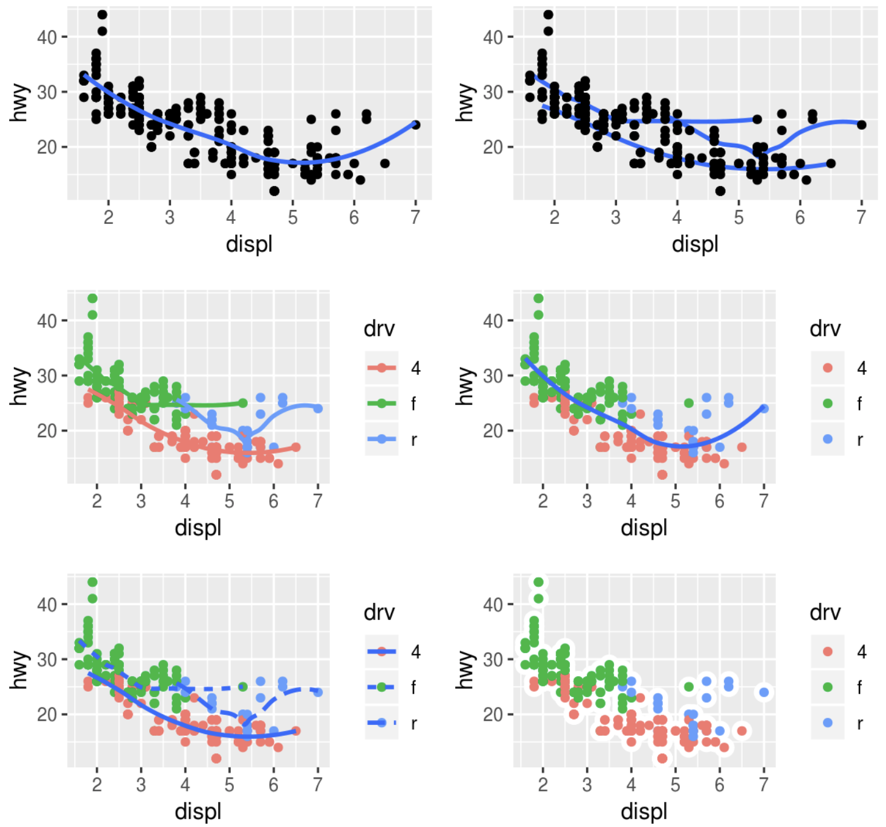

# Предварительный анализ
## Визуализация данных с помощью `ggplot2`
### Введение
Электронная версия книги по адресу http://r4ds.had.co.nz.

Для начала работы подключаем библиотеку
```{r, message=FALSE}
library("tidyverse")
```

Дополнительно, используются пакеты `install.packages(c("nycflights13", "gapminder", "Lahman"))`


А это шпаргалка [cheat_sheet](https://github.com/rstudio/cheatsheets/blob/master/data-visualization-2.1.pdf)


Не было упражнений.

### Первые шаги
#### Упражнение 3.2.1 
<div class="question">
Run `ggplot(data = mpg)` what do you see?
</div>

```{r}
ggplot(data = mpg)
```

Пустое окно построения.  Функция `ggplot()` из пакета `ggplot2` только содаёт область построения, функциями мы производим наполнение области построения. Больше инфы смотри в подсказке https://github.com/rstudio/cheatsheets/blob/master/data-visualization-2.1.pdf .

#### Упражнение 3.2.2 
<div class="question">
How many rows are in `mpg`? How many columns?
</div>

Чтобы проверить "строение" фрейма данных `mpg`,можно воспользоваться двумя способами.
Var1:
```{r}
ggplot2::mpg
```

где видно что `mpg` это матрица 234 строки на 11 столбцов.

Var2:
```{r}
glimpse(mpg)
```

Сразу тут покажу, что каждый параметр означает:

| Название      | Описание       |
| ------------- |:-------------:|
| manufacturer | изготовитель    |
| model   | модель |
| displ    | объём двигателя в литрах    |
| year | год изготовления    |
| cyl| количество цилиндров   |
| trans | тип трансмиссии     |
| drv | тип привода   |
| cty | количество пройденных миль по городу на один галлон топлива   |
| hwy | количество пройденных миль за городом на один галлон топлива   |
| fl | тип топлива    |
| class | класс автомобиля     |


#### Упражнение 3.2.3 
<div class="question">
What does the `drv` variable describe? Read the help for `?mpg` to find out.
`drv` — это имя одного из параметров, оно обозначает тип привода автомобиля.
</div>

| Краткое название        | Тип привода          |
| ------------- |:-------------:|
| f   | передний |
| r    | задний    |
| 4 | полный     |

#### Упражнение 3.2.4 
<div class="question"> 
Make a scatter plot of `hwy` vs `cyl`.
</div>

можно прописывать на одной координатной плоскости разные геометрические функции с индивидуальными параметрами, тогда правильнее будет писать вот так


Var 1
```{r 41}
ggplot(data = mpg)+
  geom_point(mapping = aes(x = hwy, y = cyl))
```

Но если параметры одни и те же, а требуется построить разные геометрии, то лучше прописать общие параметры вынося их "за скобки"
Var 2
```{r}
ggplot(data = mpg, aes(x = hwy, y = cyl))+
 geom_point()
```

#### Упражнение 3.2.5 
<div class="question">
What happens if you make a scatterplot of `class` vs `drv`? Why is the plot not useful?
<di/v>

Оба параметра являются категориальными, или описательными. Можно построить `<chr>` от `<chr>`. 
```{r}
ggplot(data = mpg) + geom_point(mapping = aes(x = class, y = drv))
```

Но с точки зрения аналитики, такая информация не несёт большой пользы. В конкретном примере можно только сказать что, все автомобили класса `2seater` имеют задний привод. А в классе `subcompact` есть все типы привода.

### Эстетика визуализации
#### Упражнения 3.3.1  
<div class="question">
What’s gone wrong with this code? Why are the points not blue? 
</div>

```{r}
ggplot(data = mpg) +
  geom_point(mapping = aes(x = displ, y = hwy, colour = "blue"))
```

Всё потому что `colour` не вынес за скобки, потому что `colour` это параметр функции `geom_point()`, not `aes()` 
правильно вот так

```{r}
ggplot(data = mpg) +
  geom_point(mapping = aes(x = displ, y = hwy), colour = "blue")
```


#### Упражнения 3.3.2  
<div class="question">
Which variables in `mpg` are categorical? Which variables are continuous? (Hint: type `?mpg` to read the documentation for the dataset). How can you see this information when you run `mpg`?  
</div>

Это те факторы, которые позволяют разделить на показатели. Чтобы понять какие факторы являются категориальными можно воспользоваться функцией `glimpse()`, которая показывает тип каждого столбца. Соответственно, те что `<chr>` и есть категориальные:

```{r}
glimpse(mpg)
```


#### Упражнения 3.3.3  
<div class="question">
Map a continuous variable to `color`, `size`, and `shape`. How do these aesthetics behave differently for categorical vs. continuous variables?  
</div>

Непрерывные переменные, это такие переменные которые принимают значения в некотором диапазоне. Непрерывной переменной является например `cty`, city miles per gallon, и показывает сколько проедет автомобиль в черте горда на один галлон топлива.
Если сопоставить этой переменной **цвет** то получится
```{r}
ggplot(mpg, aes(x = displ, y = hwy, colour = cty)) +
   geom_point()
```


Цвет распределяется в диапазоне переменной `cty`, то есть в пределах от примерно 10 до 35.
Попробуем теперь соспоставить **размер**
```{r}
ggplot(mpg, aes(x = displ, y = hwy, size = cty)) +
   geom_point()
```


В принципе получается такая же картина, только точки выделены не цветом, а размером.
И наконец, сопоставим **форму** непрерывной переменной
```{r}
#ggplot(mpg, aes(x = displ, y = hwy, shape = cty)) + geom_point()
```
А вот и нет. Программа выдаст `Ошибка: A continuous variable can not be mapped to shape`.
Непрерывные переменные не соотносятся с атрибутом `shape`, так сделано специально. Потому что фигур всего 24, а наборов значений у непрерывной переменной может быть сколь угодно много

#### Упражнения 3.3.4

<div class="question">
What happens if you map the same variable to multiple aesthetics? 
</div>

Связать можно, вот например, переменная `drv` для цвета и для формы
```{r}
ggplot(mpg, aes(x = displ, y = hwy, color = drv, shape = drv)) + geom_point()
```

но это будет избыточное выделение.

#### Упражнения 3.3.5 
<div class="question">
What does the `stroke` aesthetic do? What shapes does it work with? (Hint: use `?geom_point`)
</div>

`stroke` это размер границы фигуры. Он работает с фигурами, у которых помимо полной заливки есть цвет границы т.е. фигуры 21-24


Иллюстрирующий пример. Вот построение обычными точками
```{r}
ggplot(mpg, aes(hwy, cyl))+
 geom_point()
```

Теперь зададим красную заливку, и размер границы фигуры $2$

```{r}
ggplot(mpg, aes(hwy, cyl)) +
 geom_point(shape=21,colour="black",fill="red",size=3,stroke=2)
```

Ну а теперь $5$
```{r}
ggplot(mpg, aes(hwy, cyl)) +
 geom_point(shape=21,colour="black",fill="red",size=3,stroke=5)
```

#### Упражнения 3.3.6 
<div class="question">
What happens if you map an aesthetic to something other than a variable name, like `aes(colour = displ < 5)`?
</div>

Визуальные атрибуты можно задавать и логическими выражениями, как допустим в таком выражении:

```{r}
 ggplot(mpg, aes(displ,hwy, color = displ < 2)) +
   geom_point()
```

```{r}
 ggplot(mpg, aes(displ,hwy, color = displ < 4)) +
   geom_point()
```

```{r}
 ggplot(mpg, aes(displ,hwy, size = displ > 3)) +
   geom_point()
```

К тому же `R` ругается, что лучше бы такое не делать
### Распространённые ошибки
Проблемы случаются и это норм. Если что-то не получается,  чекни код.

Часто бывает что поставил `+` не туда. Он должен быть в конце строки, а не в начале.

### Панели
#### Упражнение 3.5.1 
<div class="question">
What happens if you facet on a continuous variable?
</div>

Как это работает. 

Построим график `highway miles per gallon` от `engine displacement, in litres`. 
```{r}
ggplot(mpg, aes(x = displ, y = hwy)) +
   geom_point()
```

Теперь разделим на "окошки" т.е. возьмём срез графиков с теми же дискретными переменными, но в разрезе типа привода автомобиля `drv` от количества цилиндров `cyl`.
```{r}
ggplot(mpg, aes(x = displ, y = hwy)) +
  geom_point() +
  facet_grid(drv ~ cyl)
```
Получилось $12$ панелей, потому что `drv` дискретная, ограниченная переменная, у неё всего три набора значения ($4, f, d$). Количество цилиндров `cyl` тоже ограниченная $4,5,6,8$. Поэтому получилось $3*4=12$ значений. Так как панелей получилось немного, такое представление осязаемо, с ним можно работать, оно информативно.

Если мы попробуем построить в одном измерении непрерывную переменную. То количество панелей возрастёт на количество значений этой переменной. Получится не очень информативно. Заменим в этом же построении количество цилиндров `cyl` на расстояние, пройденное за один галлон топлива в городской черте `cty`. Это непрерывная переменная, у которой много значений. 

```{r}
ggplot(mpg, aes(x = displ, y = hwy)) +
 geom_point() +
 facet_grid(drv ~ cty)
```
Вот что произойдет, если параметром для панели задать непрерывную переменную. Будет много окошек, информативность представленной информации падает.

#### Упражнение 3.5.2 
<div class="question">
What do the empty cells in plot with `facet_grid(drv ~ cyl)` mean? How do they relate to this plot?
</div>

Построим панели по заданному условию
```{r}
ggplot(mpg, aes(x = displ, y = hwy)) +
    geom_point() +
    facet_grid(drv ~ cyl)
```

Пустые ячейки 

* $cyl(5):drv(4)$;
* $cyl(4):drv(r)$;
* $cyl(5):drv(r)$;  

говорят о том, что нет точек удовлетворяющих этим разрезам данных. Иначе говоря, в наборе данных `mpg`

* нет полноприводных авто с 5 цилиндрами
* заднеприводных авто с 4 цилиндрами
* заднеприводных авто с 5 цилиндрами

Построим заданную функцию 
```{r}
ggplot(data = mpg) + 
  geom_point(mapping = aes(x = drv, y = cyl))
```  

Она соотносится с построенными выше панелями в том, что показывает отсутствие данных в комбинациях переменных `drv:cyl`

#### Упражнение 3.5.3 
<div class="question"> 
What plots does the following code make? What does `«.»` do?

```{r}
ggplot(data = mpg) + 
  geom_point(mapping = aes(x = displ, y = hwy)) +
  facet_grid(drv ~ .)
```

```{r}
ggplot(data = mpg) + 
  geom_point(mapping = aes(x = displ, y = hwy)) +
  facet_grid(. ~ cyl)
```
</div>

Сравним с оригиналом:
```{r}
ggplot(data = mpg) + 
  geom_point(mapping = aes(x = displ, y = hwy)) +
  facet_grid(drv ~ cyl)
```

Как видно на самих построениях, точка убирает одно из измерений панели следующим образом:

*Если точка стоит в первой координате, `(. ~ param)`, то убираются строки
*Если точка стоит во второй координате, `(param ~ .)`, то убираются столбцы

#### Упражнение 3.5.4 

<div class="question"> 
Take the first faceted plot in this section:

```{r}
ggplot(data = mpg) + 
  geom_point(mapping = aes(x = displ, y = hwy)) + 
  facet_wrap(~ class, nrow = 2)
```

What are the advantages to using faceting instead of the colour aesthetic? What are the disadvantages? How might the balance change if you had a larger dataset?
</div>

Для того чтобы сравнить это цветное выделение с выделением плитками. Посмотрим как выглядит выделение того же построения данных цветом:

```{r}
ggplot(data = mpg) + 
   geom_point(mapping = aes(x = displ, y = hwy, color = class))
```

* **Преимущество** построения плитками заключается в том, что каждая группы "очищена" от мусора других групп. Плитками проще оценить распределение точек в отдельно взятой группе. Кроме этого если выделять цветом построения с большим количеством групп, то необходимо более ответственно подходить к подбору цветов `-- нужно делать их более контрастными. Потому что при увеличении количества групп, цвета начинают сливаться, и уже трудно различать к какой категории относится точка.

* **Недостаток** построяния плитками заключается в том, что каждая группа строится в отдельной системе координат. Трудно сравнивать распределение точек между группами.

#### Упражнение 3.5.5 

<div class="question"> 
Read `?facet_wrap`. What does `nrow` do? What does `ncol` do? What other options control the layout of the individual panels? Why doesn’t `facet_grid()` have `nrow` and `ncol` arguments?
</div>

| аргумент        | что значит          |
| ------------- |:-------------:|
| `nrow`   | количество строк |
| `ncol`    | количество столбцов    |

Эти переменные нужны, так как срез графика в `facet_wrap()` происходит по одной дискретной переменной. В свою очередь `facet_grid` использует комбинации двех переменных поэтому для построения не нужно выбирать количество строк или колонок.

#### Упражнение 3.5.6 
<div class="question"> 
When using `facet_grid()` you should usually put the variable with more unique levels in the columns. Why?
</div>

Экраны наших компьютеров, книги, чертежи, имеют альбомную ориентацию и на одном носители умещается больше данных. Поэтому визуально проще сравнивать большее количество переменных по-горизонтали.

### Геометрические объекты
#### Упражнения 3.6.1 
<div class="question">
What geom would you use to draw a line chart? A boxplot? A histogram? An area chart?
</div>

На русский язык "boxplot перевели как "полосчатый график". Это конечно сбивает с толку, потому что boxplot это конечно "ящик с усами". Исходя из этого

| Название графика| Объект `geom`|
| ------------- |:-------------:|
| linechart | `geom_line` |
| boxplot    | `geom_boxplot`   |
| histogram | `geom_histogram` |
| area chart | `geom_area` |
#### Упражнения 3.6.2 
<div class="question">
Run this code in your head and predict what the output will look like. Then, run the code in R and check your predictions.
</div>

Это будет распределение `displ` от `hwy`. С цветом точек в зависимости от `drv`, т.е. три цвета - зелёный, красный и голубой. В этой же системе координат будет построена линия среднеквадратичного приближения без доверительного интервала с тем же цветом, что и точки.
```{r}
ggplot(data = mpg, mapping = aes(x = displ, y = hwy, colour = drv)) +
  geom_point() +
  geom_smooth(se = FALSE)
```

Поправочка - будет три линии приближений с цветом, соответсвующим цвету точек, по которым строится это приближение

#### Упражнения 3.6.3 
<div class="question">
What does `show.legend = FALSE` do? What happens if you remove it? Why do you think I used it earlier in the chapter?
</div>

Автор имеет в виду этот пример

```{r}
ggplot(mpg) +
  geom_smooth(
    mapping = aes(displ, hwy, colour = drv),
    show.legend = FALSE
  )
```

Инструкция `show.legend` распоряжает показывать легенду графика или нет. По умолчанию эта инструкция имеет значение `TRUE`. В примере из книги, инструкция `show.legend = FALSE` использовалась намеренно, чтобы в максимальном размере уместить в одну строку три графика. Тот же график с легендой выглядит вот так:
```{r}
ggplot(mpg) +
  geom_smooth(
    mapping = aes(displ, hwy, colour = drv)
  )
```


#### Упражнения 3.6.4 
<div class="question">
What does the `se` argument to `geom_smooth()` do?
</div>

Аргумент `se` распоряжает показывать ли доверительный интервал или нет. По умолчанию этот интервал показывается. В примере ниже доверительный интервал показывается:
```{r}
ggplot(mpg) + 
  geom_smooth(mapping = aes(displ, hwy))
```

Теперь уберём его:
```{r}
ggplot(mpg) + 
  geom_smooth(mapping = aes(displ, hwy), se = FALSE)
```

#### Упражнения 3.6.5 
<div class="question">
Will these two graphs look different? Why/why not?

```{r, eval = FALSE}
ggplot(data = mpg, mapping = aes(x = displ, y = hwy)) + 
  geom_point() + 
  geom_smooth()
```

```{r, eval = FALSE}
ggplot() + 
  geom_point(data = mpg, mapping = aes(x = displ, y = hwy)) + 
  geom_smooth(data = mpg, mapping = aes(x = displ, y = hwy))
```
</div>

Эти графики будут идентичными, потому что в первом случае в функции `ggplot()` задаются исходные условия сразу для всех функций, которые будут строится на этом поле построения. А во втором случае, все исходные условия для построений указаны в каждой функции индивидуально. И так как различий в этих условиях нет, то выглядеть они будут одинаково:
```{r}
ggplot(data = mpg, mapping = aes(x = displ, y = hwy)) + 
  geom_point() + 
  geom_smooth()
```

```{r}
ggplot() + 
  geom_point(data = mpg, mapping = aes(x = displ, y = hwy)) + 
  geom_smooth(data = mpg, mapping = aes(x = displ, y = hwy))
```

#### Упражнения 3.6.6 
<div class="question">
Recreate the R code necessary to generate the following graphs.

</div>


1. В левом верхнем графике наложено два построения. Первое `geom_point()` - обычное построение без какой либо группировки и цветового выделения. Второе `geom_smouth()` - построение распределения без группировки и цветового выделения, без построения доверительного интервала. Так как у обоих построений одинаковые исходные условия, их можно "вынести за скобки", то есть указать в "родительском" `ggplot()`:
```{r}
 ggplot(mpg, mapping = aes(displ, hwy)) +
   geom_point() +
   geom_smooth(se = FALSE)
```

2. В правом верхнем графике наложено два построения. Первое `geom_point()` - обычное построение без какой либо группировки и цветового выделения. Второе `geom_smouth()` - построение распределения с группировкой по признаку `drv`, без построения доверительного интервала. Так как у двух постройний разные условия, лучше для каждого прописать исходные данные индивидуально
```{r}
 ggplot(mpg) +
    geom_point(mapping = aes(displ, hwy)) +
    geom_smooth(mapping = aes(displ, hwy, group = drv), se = FALSE)
```

3. В левом среднем графике наложено два построения. Первое `geom_point()` - с цветовой группировкой  по признаку `drv`. Второе `geom_smouth()` - построение распределения с цветовой группировкой по признаку `drv`, без построения доверительного интервала. Так как у обоих построений одинаковые исходные условия, их можно "вынести за скобки", то есть указать в "родительском" `ggplot()`:
```{r}
 ggplot(mpg, mapping = aes(displ, hwy, colour = drv)) +
    geom_point() +
    geom_smooth(se = FALSE)
```

4. В правом среднем графике наложено два построения. Первое `geom_point()` - с цветовой группировкой  по признаку `drv`. Второе `geom_smouth()` - построение распределения без группировки и цветового выделения, без построения доверительного интервала. Так как у двух постройний разные условия, лучше для каждого прописать исходные данные индивидуально:
```{r}
 ggplot(mpg) +
    geom_point(mapping = aes(displ, hwy, colour = drv)) +
    geom_smooth(mapping = aes(displ, hwy), se = FALSE)
```

5. В левом нижнем графике наложено два построения. Первое `geom_point()` - с цветовой группировкой  по признаку `drv`. Второе `geom_smouth()` - построение распределения с группировкой по признаку `drv`, с выделением каждой кривой группы разным типом линии, без построения доверительного интервала. Так как у двух постройний разные условия, лучше для каждого прописать исходные данные индивидуально:
```{r}
 ggplot(mpg) +
    geom_point(mapping = aes(displ, hwy, colour = drv)) +
    geom_smooth(mapping = aes(displ, hwy, linetype = drv), se = FALSE)
```

6. В правом нижнем графике только одно построение `geom_point()` - с цветовой группировкой  по признаку `drv` и толстыми белыми границами у точек.
```{r}
 ggplot(mpg, mapping = aes(displ, hwy, fill = drv)) +
    geom_point(shape = 21, colour = "white", size = 4, stroke = 4)
```


### Статистические преобразования
#### Упражнения 3.7.1 
<div class="question">
What is the default geom associated with `stat_summary()`? How could you rewrite the previous plot to use that geom function instead of the stat function?
</div>


Для того чтобы ответить на этот вопрос, необходимо открыть help - `?stat_summary`

`stat_summary(mapping = NULL, data = NULL, geom = "pointrange", position = "identity", ..., fun.data = NULL, fun.y = NULL, fun.ymax = NULL, fun.ymin = NULL, fun.args = list(), na.rm = FALSE, show.legend = NA, inherit.aes = TRUE)`

 Это и есть ответ - со статистикой  `stat_summary()` связана геометрия `geom = "pointrange"`.
 
 Теперь ответим на вопрос, как можно переписать код
 
```{r}
ggplot(data = diamonds) + 
  stat_summary(
    mapping = aes(x = cut, y = depth),
    fun.ymin = min,
    fun.ymax = max,
    fun.y = median
  )
```

Необходимо заменить `stat_summary()` на `geom_pointrange()` и вставить название необходимой статистики:
```{r}
ggplot(data = diamonds) + 
  geom_pointrange(
    mapping = aes(x = cut, y = depth),
    stat = "summary",
    fun.ymin = min,
    fun.ymax = max,
    fun.y = median
  )
```

#### Упражнения 3.7.2 
<div class="question">
What does `geom_col()` do? How is it different to `geom_bar()`?
</div>

Функции имеют разные статистики по умолчанию. `geom_bar()` иметт `stat_count()`, а `geom_col()` имет `stat_identity()` Т.е. `geom_bar()` считает, сколько наблюдений попадает в просматриваемый диапазон и столбец показывает количество попавших наблюдений в диапазон. А `geom_col()` - строит столбцы по количеству наблюдений в диапазоне, а `geom_bar()` число наблюдений.

#### Упражнения 3.7.3 
<div class="question">
Most geoms and stats come in pairs that are almost always used in concert. Read through the documentation and make a list of all the pairs. What do they have in common?
</div>

Общие элементы у статистик и геометрий это `aes()`, `position`, а пары геометрия-статистика следующие:

| `geom_`        | `stat_`         |
| ------------- |:-------------:|
| `path`  | `eclipse`, `function`|
| `point`    | `identity`, `unique`  |
| `tile` | `summary_2d`    |
| `hex` | `summary_hex`    |
| `pointrange` | `summary_bin`, `summary`|

#### Упражнения 3.7.4 
<div class="question">
What variables does `stat_smooth()` compute? What parameters control its behavior?
</div>

* `y` - predicted value, прогнозируемое значение

* `ymin` -  lower pointwise confidence interval around the mean, нижний уровень доверительного интервала среднего значения

* `ymax` -  upper pointwise confidence interval around the mean, верхний уровень доверительного интервала среднего значения

* `se` - standard error, стандтартное отклонение

Я так полагаю, параметры которые регулируют поведение функции, это специальные методы. Если это не так, то я однажды вернусь сюда и дополню этот ответ.

#### Упражнения 3.7.5 
<div class="question">
In our proportion bar chart, we need to set group = 1 Why? In other words what is the problem with these two graphs?

Graph #1
```{r, eval = FALSE}
ggplot(data = diamonds) + 
  geom_bar(mapping = aes(x = cut, y = ..prop..))
```

Graph #2
```{r, eval = FALSE}
ggplot(data = diamonds) + 
  geom_bar(mapping = aes(x = cut, fill = color, y = ..prop..))
```
</div>

Если не указать значение `group`, то все столбики то есть построения будут иметь `prop = 1`. Функция `geom_bar` по умолчанию использует статистику `stat_count`, которая считает количество значений внутри группы.
```{r}
ggplot(data = diamonds) + 
  geom_bar(mapping = aes(x = cut, y = ..prop..))

ggplot(data = diamonds) + 
  geom_bar(mapping = aes(x = cut, fill = color, y = ..prop..))
```

Проблема с этими двумя графиками заключается в том, что пропорции вычисляются внутри групп. Чтобы исправить, нужно указать группы в этих графиках:
```{r}
ggplot(data = diamonds) + 
  geom_bar(mapping = aes(x = cut, y = ..prop.., group = 1))

ggplot(data = diamonds) + 
  geom_bar(mapping = aes(x = cut, fill = color, y = ..prop.., group = color))
```

### Позиционные настройки

В заданиях часто используется фрейм данных `diamonds`, укажем его здесь:

|параметр| описание |
| ------------- |:-------------:|
| `price`| цена в долларах  (\$326–\$18,823)|
| `carat`| вес бриллианта (0.2–5.01)|
| `cut`| качество огранки (Fair, Good, Very Good, Premium, Ideal)|
| `color`|цвет бриллианта J (worst) to D (best)|
| `clarity`|чистота, или прозрачность (I1 (worst), SI2, SI1, VS2, VS1, VVS2, VVS1, IF (best) |
| `x`| длинна в мм |
| `y`| ширина в мм |
| `z`| высота в мм|
| `depth`|  величина total depth percentage = z / mean(x, y) = 2 * z / (x + y) (от 43 до 79)|
| `table`| ширина верхней части алмаза относительно самой широкой точки (от 43 до 95)|

варианты использования аргумента `position`:

* `position = "identity"`. Строит столбцы с перекрыванием, т.е. в точности, где каждый объект должен находится. Это сложно заметить, поэтому если есть необходимость использовать эту настройку, то чтобы увидеть перекрытие нужно дополнительно указывать параметр прозрачности `alpha`:

```{r}
ggplot(
  data = diamonds,
  mapping = aes(x = cut, fill = clarity)) +
  geom_bar(alpha = 1/5, position = "identity")
```

или делать объекты незалитыми убирая у атрибута `fill` цвет:

```{r}
ggplot(
  data = diamonds,
  mapping = aes(x = cut, color = clarity)) +
  geom_bar(fill = NA, position = "identity")
```

* `position = "fill"` Создаёт стековые столбцы одинаковой высоты. Удобно сравнивать пропорции у значений.

```{r}
ggplot(diamonds) +
  geom_bar(
    mapping = aes(x = cut, fill = clarity),
    position = "fill"
    )
```

* `position = "dodge"`. Строит перекрывающиеся столбцы рядом друг с другом

```{r}
ggplot(diamonds) +
  geom_bar(
    mapping = aes(x = cut, fill = clarity),
    position = "dodge"
    )
```

* `position = "jitter"`. Не подходит для столбчатых диаграмм, но отлично подходит для диаграмм рассеивания. Если точки пересекаются, то чтобы показать истинное распределение значений `jitter` добавляет "шум"

```{r}
ggplot(mpg) + 
  geom_point(
    mapping = aes(displ, hwy),
    position = "jitter"
  )
```

#### Упражнения 3.8.1 
<div class="question">
What is the problem with this plot? How could you improve it?

```{r}
ggplot(data = mpg, mapping = aes(x = cty, y = hwy)) +
  geom_point()
```  
</div>

Это иллюстрация приведённой в книге проблемы **наложение графиков**. Все значения наносимые на график округляются - поэтому в одной точке может быть наложено несколько значений. Чтобы показать истинное количество точек в одном положении можно воспользоваться функцией `geom_jitter`, которой добавит случайный шум каждой точке.

```{r}
ggplot(data = mpg, mapping = aes(x = cty, y = hwy)) +
  geom_jitter()
```

#### Упражнения 3.8.2 
<div class="question">
What parameters to `geom_jitter()` control the amount of jittering?
</div>

Согласно описанию [`geom_jitter()`](https://ggplot2.tidyverse.org/reference/geom_jitter.html) есть два параметра для управления флуктуациями:

-   `width` для вертикального распределения
-   `height` для горизонтального распределения

Разберём на примере. Возьмём диаграмму рассеивания:

```{r}
 ggplot(mpg, aes(cty, hwy)) + geom_point()
```

Добавим флуктуаций:
```{r}
 ggplot(mpg, aes(cty, hwy)) + geom_jitter()
```

Отрегулируем умеренные флуктуации, установив значение параметров `width` и `height` равным $0,5$

```{r}
ggplot(mpg, aes(cty, hwy)) + geom_jitter(width = 0.5, height = 0.5)
```

#### Упражнения 3.8.3 
<div class="question">
Compare and contrast `geom_jitter()` with `geom_count()`.
</div>

Возьмём данные из предыдущего примера, в которых уже известно, что происходит наложение данных:

```{r}
 ggplot(mpg, aes(cty, hwy)) + geom_point()
```

```{r}
 ggplot(mpg, aes(cty, hwy)) + geom_jitter()
```

Теперь посмотрим что делает `geom_count()`

```{r}
 ggplot(mpg, aes(cty, hwy)) + geom_count()
```

Функция `geom_count()` тоже демонстрирует, что точки в построении накладываются. Но она делает это изящнее - в зависимости от количества точек, попавших в одно построение, увеличивается диаметр окружности. 

* Преимущество `geom_count()` - не изменяются координаты точек.
* Недостаток `geom_count()` - в зависимости от количества точек, радиус окружности может перекрывать рядом лежащие точки.

Впрочем, в этом случае можно использовать дополнительное выделение цветом:

```{r}
 ggplot(mpg, aes(cty, hwy, color = drv)) + geom_count()
```

#### Упражнения 3.8.4 
<div class="question">
What’s the default `position` adjustment for `geom_boxplot()`? Create a visualization of the `mpg` dataset that demonstrates it.
</div>

Согласно описанию функции `geom_boxplot()` значение по умолчанию у параметра `position = "dodge2"`.
Оба парамтера `"dodge"` и `"dodge2"` строят рядом перекрывающиеся объекты рядом. Разница в том, что `"dodge"` лепит их вплотную, а `"dodge2"` добавляет промежуток. Или не совсем...

```{r}
ggplot(diamonds) +
  geom_bar(
    mapping = aes(x = cut, fill = clarity),
    position = "dodge"
    )
```

```{r}
ggplot(diamonds) +
  geom_bar(
    mapping = aes(x = cut, fill = clarity),
    position = "dodge2"
    )
```

Пример для визуализации. 

```{r}
ggplot(mpg, aes(cty, hwy, color = drv)) + geom_boxplot()
```

Если использовать другое значение для `position`, то ящики будут накладываться друг на друга:

```{r}
ggplot(mpg, aes(cty, hwy, color = drv)) + geom_boxplot(position = "identity")
```

### Системы координат
#### Упражнения 3.9.1 
<div class="question">
Turn a stacked bar chart into a pie chart using `coord_polar()`
</div>

Хорошо, сначала построим стековую диаграмму:

```{r}
ggplot(mpg, aes(x = factor(1), fill = factor(cyl))) +
 geom_bar()
```

**РАЗОБРАТЬСЯ ЧТО ДЕЛАЕТ `factor()`**

Всё описание работы есть [`coord_polar()`](https://ggplot2.tidyverse.org/reference/coord_polar.html) поэтому я ограничусь здесь только выполнением задания.
В документации к построению "пирогов" сказано что, нужно относится к этим построениям максимально острожно, что коррелирует с тем, что говорится в [дизайне и  визуализации](https://lpgenerator.ru/blog/2015/11/27/pochemu-vam-luchshe-perestat-ispolzovat-krugovye-diagrammy-ili-net/)

```{r}
ggplot(mpg, aes(x = factor(1), fill = factor(cyl))) +
 geom_bar() + coord_polar(theta = "y")
```

Можно использовать пример из упражнений

```{r}
ggplot(diamonds) +
  geom_bar(
    mapping = aes(x = cut, fill = clarity),
    position = "fill"
    )
```


```{r}
ggplot(diamonds) +
  geom_bar(
    mapping = aes(x = cut, fill = clarity),
    position = "fill") +
    coord_polar(theta = "y")
```    

#### Упражнения 3.9.2 
<div class="question">
What does `labs()` do? Read the documentation.
</div>

Функция `labs()` нужна для подписей всего того что отображается на графике. Всё описание есть в хэлпе.

```{r}
ggplot(mpg) +
    geom_point(mapping = aes(displ, hwy, colour = drv)) +
    labs(color = "Новое название", 
         x = "ося порося",
         y = "ося лося",
         title = "Заголовок", 
         subtitle = "под-заголовок", 
         tag = "тэг")
```

#### Упражнения 3.9.3 
<div class="question">
What’s the difference between `coord_quickmap()` and `coord_map()`?
</div>

`Coord_map` проецирует часть земли, которая к слову является приблизительно сферической, на плоскую 2D-плоскость, используя любую проекцию, определенную пакетом `mapproj`. Карты, как правило, не сохраняют прямых линий, поэтому это требует значительных вычислений. Coord_quickmap - быстрое приближение, которое сохраняет прямые линии. Он лучше всего подходит для небольших площадей ближе к экватору.

По умолчанию, `coord_map()` использует [проекцию Меркатора](https://ru.wikipedia.org/wiki/Проекция_Меркатора).
Собственно в хэлпе больше информации с примерами. [ggplot](https://ggplot2.tidyverse.org/reference/coord_map.html)

#### Упражнения 3.9.4 
<div class="question">
What does the plot below tell you about the relationship between city and highway mpg? Why is `coord_fixed()` important? What does `geom_abline()` do?
</div>

```{r}
ggplot(data = mpg, mapping = aes(x = cty, y = hwy)) +
  geom_point() + 
  geom_abline() +
  coord_fixed()
``` 
 
Функция `coord_fixed()` представляет количество единиц по оси Y, эквивалентное одной единице по оси X. Что в свою очередь гарантирует, что линия, созданная `geom_abline()`, имеет угол $45^{\circ}$. 45-градусная линия позволяет легко сравнить пробег по шоссе и городу с корпусом, в котором город и шоссе MPG были равны.

```{r}
ggplot(data = mpg, mapping = aes(x = cty, y = hwy)) +
  geom_point() + 
  geom_abline()
```

### Многослойная грамматика графики
Шаблон кода после всего пройденного материала выглядит следующим образом:
```
ggplot(data = <DATA>) + 
  <GEOM_FUNCTION>(
     mapping = aes(<MAPPINGS>),
     stat = <STAT>, 
     position = <POSITION>
  ) +
  <COORDINATE_FUNCTION> +
  <FACET_FUNCTION>
```

## Рабочий процесс: основы
### Основы написания кода
Для вывода символа присвоения `<-` на MacBook, необходимо нажать комбинацию клавиш <option> + <-> (минус)
### Что представляют собой имена
`R` чувствителен к регистру.

### Вызов функций
Не было упражнений

#### Упражнение 4.4.1
<div class="question">
  Why does this code not work?
  
```{r, eval = FALSE}
my_variable <- 10
my_varıable
```

Look carefully! (This may seem like an exercise in pointlessness, but training your brain to notice even the tiniest difference will pay off when programming.)
</div>
  
  Код не работает, потому что допущена опечатка при вызове функции. Обратите внимание на `i`. Пишите без ошибок.

#### Упражнение 4.4.2
<div class="question">
```{r, eval = FALSE}
library(tidyverse)

ggplot(dota = mpg) + 
  geom_point(mapping = aes(x = displ, y = hwy))

fliter(mpg, cyl = 8)
filter(diamond, carat > 3)
```
</div>
  
  Должно быть так. В названии библиотеки забыли кавычки `""`

```{r, eval = FALSE}
library("tidyverse")
```

При объявнлении исходных данных допущена ошибка. Вместо `data` написано `dota`

```{r, eval = FALSE}
ggplot(data = mpg) + 
  geom_point(mapping = aes(x = displ, y = hwy))
```

В следующем примере пришлось чуть повозиться. Тут одновременно несколько ошибок. Вместо `filter()` написано `fliter()`. А при объявлении, нужно было правильно сравнивать вместо `=` надо `==`

```{r, eval = FALSE}
filter(mpg, cyl = 8)
```

И в последнем примере при объявлении фрейма данных допущена опечатка. Вместо `diamond` надо писать `diamonds`.
```{r, eval = FALSE}
filter(diamonds, carat > 3)
```

#### Упражнение 4.4.3
<div class="question">
  Press Alt + Shift + K. What happens? How can you get to the same place using the menus?
</div>
  
Это открывает меню шорт-катов, чтобы открыть его "вручну" нужно пройти по адресу `Tools -> Keyboard Shortcuts Help`.

## Преобразование данных с помощью пакета `dplyr`
### Введение
#### Используемые ресурсы

```{r}
library(nycflights13)
library(tidyverse)
library(dplyr)
```

Некоторые имена функций в разных библиотеках дублируются. Когда в `R` подключается несколько пакетов, в которых названия функций дублируются, программа выдает сообщение об ошибке

```{}
── Conflicts ─────────────────────────────────────────────────────────────────────────────── tidyverse_conflicts() ──
✖ dplyr::filter() masks stats::filter()
✖ dplyr::lag()    masks stats::lag()
```

Для того чтобы обратится к необходимой функции, нужно использовать полное имя `stats::filter()`, `stats::lag()`

#### Пакет `nycflights13`

|Переменная      | Описание       |
| ------------- |:------------------:|
| `int` | целые числа    |
| `dbl` | числа с плавающей точкой    |
| `chr` | символьные векторы или строки    |
| `dttm` | дата + время    |
| `lgl` | булевы векторы    |
| `fctr` |факторы   |
| `date` | даты    |

#### Основные сведения о пакете `dplyr`

Минимум для работы с этим пакетом:

|Функция       | Описание    |
| ------------ |:----------------------------------------------:|
| `filter()`   | выбор наблюдений по их значениям |
| `arrange()`  | перестановка строк |
| `select()`   | выбор переменных по их именам|
| `mutate()`   | создание новых переменных с использованием существующих|
| `summarize()`| сведение нескольких значений в одно итоговое |
| `group_by()` | изменяет область действия функции от всего набора данных до отдельных участков|

Все глаголы подчиняются одному и тому же синтаксису

1. Первый аргумент $-$ это фрейм данных

1. Последующие аргументы описывают действия, которые должны быть выполнены по отношению к фрейму данных.

1. Результат $-$ это новый фрейм данных

### Фильтрация строк с помощью функции `filter()`

Функция `filter()` позволяет что бы вы думали? позволяет фильтровать! Первым аргументом указываем фрейм данных, последующие аргументы, это параметры (столбцы) которые мы желаем отфильтровать через операторы сравнения.

```{r}
filter(flights, month == 1, day != 1)
```

Функция `filter()`, как и многие другие расширения пакета `dplyr`, не изменяют исходных данных. Желаемый фильтр нужно присвоить в новую переменную

```{r}
jan1 <- filter(flights, month == 1, day == 1)
```

Если нужно выполнить присвоение и вывод на экран, нужно обнять выражение скобками.

```{r}
(jan1 <- filter(flights, month == 1, day == 1))
```


#### Сравнения

Операторы сравнения стандартные `>`, `>=`, `<`, `<=`, `==`, `!=` 

Компьюьеры используют арифметику конечной точности. Поэтому

```{r}
sqrt(2) ^ 2 == 1
```

#### Логические операторы

Булевы операторы: И - `&`, ИЛИ - `|`, НЕ - `!`, исключающее ИЛИ - `xor()`.
Полный набор булевых операций показан на рисунке.


Что следует помнить. Добавляя булевы операторы в функцию `filter()` необходимо помнить, что сравнивать нужно программно, а не так как это звучит лексически. То есть, если мы хотим все авиарейсы отправленные в декабре и ноябре, нужно писать так.

```{r}
(filter(flights, month == 11 | month == 12))
```

Что дословно произносится как "отфильтровать все полёты из набора данных `flights`, вылетавших в месяце ноябре или в месяце декабре". Можно следовать лексическому соответствию, но для этого нужно использовать оператор `%in%`

```{r}
(filter(flights, month %in% c(11, 12)))
```

**Закон Моргана:**

* `!(x & y) == !x | !y`

* `!(x | y) == !x & !y`

Проверь на рисунке выше.

#### Отсутствующие значения

Функция `filter()` включает в вывод лишь те строки, для которых условие имеет значение `TRUE`. `FALSE` и `NA` исключаются.

Для того чтобы проверить является ли используемое значением отсутствующим можно использовать функцию `is.na()`

#### Упражнение 5.2.4.1 
<div class="question">
Найдите все авиарейсы, которые
</div>

* а) задержались с прилётом на два и более часа

```{r}
(arr_delay <- filter(flights, arr_delay >= 120))
```

* б) вылетали в Хьюстон (аэропорты IAH и HOU)

```{r}
(hou_flight <- filter(flights, dest == "IAH" | dest == "HOU"))
```

* в) Обслуживались авиакомпаниями United, American or Delta

Для того чтобы узнать аббревиатуры перевозчиков, смотрим `airlanes` в хэлпе

Получается: United - это `UA`, American - `AA`, Delta - `DL`. Тогда искомые данные это:

```{r}
(three_carriers <- filter(flights, carrier %in% c("UA", "AA", "DL")))
```

* г) Вылетали в летнее время (июль, август, сентябрь). Странное у них летнее время

```{r}
(sum_flights <- filter(flights, month %in% c(7, 8, 9)))
```

* д) Прилетали с опозданием более чем на два часа но не задерживались с вылетом

```{r}
(dep_arr_delay <- filter(flights, arr_delay > 120, dep_delay <= 0))
```

* е) Вылетали с задержкое не менее чем на час, но наверстывали более 30 минут во время полёта. Если полёт проходит ровно, то задержка отправления равна задержке прибытия. `Или dep_delay - arr_delay == 0`. Так как самолёт наверстал в пути, значит разница равна не нулю, она больше 30.

```{r}
(speedy_flights <- filter(flights, dep_delay >= 60, dep_delay - arr_delay > 30 ))
```

* ж) Вылетали между полуночью и 6 часами утра включительно

```{r}
(moon <- filter(flights, dep_time == 2400 | dep_time <= 600))
```

#### Упражнение 5.2.4.2 
<div class="question">
Another useful `dplyr` filtering helper is `between()`. What does it do? Can you use it to simplify the code needed to answer the previous challenges?
</div>

Из описания в хэлпе, функция `between()` это короткая запись для `>= left & x <= right`. Или если быть точным: `between(x, left, right)`. Конечно её гораздо удобнее использовать. Эту функцию можно применить к упражнению  *г*. Сравним:

```{r}
(sum_flights <- filter(flights, month %in% c(7, 8, 9)))
```

```{r}
(sum_flights <- filter(flights, between(month, 7, 9)))
```

#### Упражнение 5.2.4.3 
<div class="question">
How many flights have a missing `dep_time`? What other variables are missing? What might these rows represent?
</div>

```{r}
(filter(flights, is.na(dep_time)))
```

Ответ 8255 рейсов. Так же отсутствуют: `dep_delay`, `arr_time`, `arr_delay`. Вероятно это отменённые рейсы.

#### Упражнение 5.2.4.4 
<div class="question">
Why is `NA ^ 0` not missing? Why is `NA | TRUE` not missing? Why is `FALSE & NA` not missing? Can you figure out the general rule? (`NA * 0` is a tricky counterexample!)
</div>

1. `NA ^ 0 == 1`. Всё в точности с математикой, которая говорит, что любое значение в степени 0 == 1 или точнее $x^0=1$

1. `NA | TRUE`. Всё или ПРАВДА всегда правда :

| $a$ | $b$ | $a\lor b$ |
|:-:|:-:|:-:|
| 0 | 0 | 0 |
| 0 | 1 | 1 |
| 1 | 0 | 1 |
| 1 | 1 | 1 |

1. `FALSE & NA`. Всё и ЛОЖЬ всегда Ложь.

| $a$ | $b$ | $a\land b$ |
|:-:|:-:|:-:|
| 0 | 0 | 0 |
| 0 | 1 | 0 |
| 1 | 0 | 0 |
| 1 | 1 | 1 |

1. `NA * 0`. Причина по которой значение неопределено. Это то что умножение чего угодна на бесконечность, равно бесконечности, или правильнее - неопределённое значение. [нечисло](https://ru.wikipedia.org/wiki/NaN)


### Перестановка строк с помощью функции `arange()`

Синтаксис у этой функции такой же как у фильтра. `arranga()` сортирует по убыванию, а не фильтрует список. При этом отсутствующие значения всегда остаются в конце. При этом для сортировки по возрастанию используется функция `desc()`

#### Упражнение 5.3.1.1 
<div class="question">
How could you use `arrange()` to sort all missing values to the start? (Hint: use `is.na()`).
</div>

Берём пример из учебника.

```{r}
arrange(flights, desc(arr_delay))
```

Добавляем как подсказывают, функцию `is.na()`

```{r}
arrange(flights, desc(is.na(arr_delay)))
```

#### Упражнение 5.3.1.2
<div class="question">
Sort `flights` to find the most delayed flights. Find the flights that left earliest.
</div>

Чтобы найти рейсы с самыми большими задержками, сортируем по возрастанию соответствующий столбец `dep_delay`

```{r}
arrange(flights, desc(dep_delay))
```

Первые десять рейсов задерживались на время от 896 минут до 1301, это почти сутки (21 час) в аэропорте. Уффф.

Чтобы найти рейсы с самым ранним временем вылета, сортируем по убыванию соответствующий столбец `dep_time`

```{r}
arrange(flights, dep_time)
```

Ожидаемо, это время вылетов в полночь и минутой позднее.

#### Упражнение 5.3.1.3
<div class="question">
Sort `flights` to find the fastest flights.
</div>

Чтобы найти самые быстрые полёты, отсортируем все полёты по времени проведённому в воздухе. Это столбец `air_time` отсортированный по возрастанию.

```{r}
arrange(flights, air_time)
```

#### Упражнение 5.3.1.4
<div class="question">
Which flights traveled the longest? Which traveled the shortest?
</div>

Сделаем так, сначала отсортируем по расстоянию, а потом по времени проведённому в воздухе

```{r}
arrange(flights, desc(distance))
```

Самые длинные полёты из `JFK` в `HNL`. Из Нью-Йорка в Гонолулу - 4983 мили.

```{r}
arrange(flights, desc(distance))
```

[Полёт длится 691 минуту](https://www.google.com/maps/dir/Гонолулу+(HNL),+300+Rodgers+Blvd,+Honolulu,+HI+96819,+США/JFK+International+Airport,+New+York,+NY,+USA/@27.4344347,-126.6384014,4.03z/data=!4m14!4m13!1m5!1m1!1s0x7c006f943168f55f:0x7ed111b1cbf331df!2m2!1d-157.9250736!2d21.3245132!1m5!1m1!1s0x89c26650d5404947:0xec4fb213489f11f0!2m2!1d-73.7781391!2d40.6413111!3e4)


```{r}
arrange(flights, distance)
```

Самый короткий из `EWR` в `LGA`. Перелёт в пределах Нью-Йорка, который по всей видимости не состоялся, так как у него нету времени полёта. Следующий за ним это полёт из Нью-Арка в Филадельфию - 80 миль. Посмотрим ещё и по времени, проведённому в воздухе:

```{r}
arrange(flights, distance, air_time)
```

### Выбор столбцов с помощью функции `select()`

Функция `select()` помогает отобрать из фрейма данных необходимые столбцы. Синтаксис простой и привычный

* Указать конкретные столбцы можно через запятую 
```{r}
select(flights, year, month, day)
```

* Указать столбцы в промежутке
```{r}
select(flights, year:day)
```

* Выбрать всех столбцов за исключением тех, которые находятся между столбцами включая последние
```{r}
select(flights, -(year:day))
```

* `start_with("abc")` - соответствует именам, начинающимся с последовательности символов "abc"

* `end_with("abc")` - соответствует именам, заканчивающимся последовательностью символов "abc"

* `contains("abc")` - соответствует именам, содержащим последовательности символов "abc"

* `matches("(.)\\1")` - выбирает переменные, соответствующие регулярному выражению.

* `num_range("x", 1:3)` - соответствует `x1`, `x2`, `x3`

* Переименовать переменные, сохраняя все переменные не указанные в явном виде
```{r}
rename(flights, tail_num = tailnum)
```

* Переместить в начало переменные.
```{r}
select(flights, time_hour, air_time, everything())
```

#### Упражнение 5.4.1.1
<div class="question">
Brainstorm as many ways as possible to select `dep_time`, `dep_delay`, `arr_time`, and `arr_delay` from `flights`.
</div>


1. Указать конкретные столбцы через запятую
```{r}
select(flights, dep_time, dep_delay, arr_time, arr_delay)
```

1. Указать столбцы в промежутке и исключить лишние
```{r}
select(flights, dep_time:arr_delay, -sched_dep_time, -sched_arr_time)
```

1. Изощренный способ. Перенесём в начало нужные столбцы, отбросим лишние в промежутке
```{r}
new_flights <- select(flights, dep_time, dep_delay, arr_time, arr_delay, everything())
select(new_flights, -(year:time_hour))
```

1. Укажем номера столбцов
```{r}
select(flights, 4, 5, 6, 9)
```

1. Столбцы начинающиеся на `dep_` и `arr_`
```{r}
select(flights, starts_with("dep_"), starts_with("arr_"))
```

1. Столбцы содержащие и не содержащие
```{r}
select(flights, contains("_time"), contains("_delay"), -contains("sched"), -contains("air"))
```

#### Упражнение 5.4.1.2
<div class="question">
What happens if you include the name of a variable multiple times in a `select()` call?
</div>

Если одна и та же переменная указана несколько раз, она всё равно отобразится один раз
```{r}
select(flights, dep_time, dep_time, dep_time)
```

#### Упражнение 5.4.1.3
<div class="question">
What does the `one_of()` function do? Why might it be helpful in conjunction with this vector?
</div>

Функция `one_of()` берёт переменные в символьном векторе. Это может быть полезно, если как в примере у нас есть символьный вектор значений, которые необходимо взять

```{r}
vars <- c("year", "month", "day", "dep_delay", "arr_delay")
select(flights, one_of(vars))
```

#### Упражнение 5.4.1.4
<div class="question">
Does the result of running the following code surprise you? How do the select helpers deal with case by default? How can you change that default?
</div>

```{r}
select(flights, contains("TIME"))
```

Удивительно, что `contains()` невосприимчив к регистру:

```{r}
select(flights, contains("time"))
```

Оказывается, это регшулируется параметром `ignore.case` который по умолчанию `TRUE`:

```{r}
select(flights, contains("TIME", ignore.case = FALSE))
```


Вот список всех функций, согласно хэлпу, невосприимчивых по умолчанию к регистру:

* `starts_with(match, ignore.case = TRUE, vars = peek_vars())`

* `ends_with(match, ignore.case = TRUE, vars = peek_vars())`

* `contains(match, ignore.case = TRUE, vars = peek_vars())`

* `matches(match, ignore.case = TRUE, vars = peek_vars())`

### Добавление столбцов с помощью функции `mutate()`

Функция `mutate()` позволяет добавлять в конец исходного фрейма данных столбцы. 

Сделаем чуть более показательный набор данных:
```{r}
flights_sml <- select(flights, 
  year:day, 
  ends_with("delay"), 
  distance, 
  air_time
)
```


Теперь добавим в конец этого набора дополнительные вычисления
```{r}
mutate(flights_sml,
  gain = dep_delay - arr_delay,
  speed = distance / air_time * 60
)
```

Чтобы сохранить только вычисления, без указания дополнительных столбцов, используется функция `transmute()`

```{r}
transmute(flights,
  gain = dep_delay - arr_delay,
  hours = air_time / 60,
  gain_per_hour = gain / hours
)
```

#### Полезные функции создания объектов

* Арифметические операторы `+`, `-`, `*`, `/`, `^`

* Модулярная арифметика. Целочисленное деление - `%/%`. Взятие остатка - `%%`. Показательный пример:

```{r}
transmute(flights,
  dep_time,
  hour = dep_time %/% 100,
  minute = dep_time %% 100
)
```

* Логарифмические функции `log()`, `log2`, `log10()`

* Смещения. Вперёд - `lag()`. Назад - `lead()`

* Кумулятивные и скользящие агрегаты. `cumsum()`, `cummin()`, `cumprod()`, `cummax()`, `cummean()`

* Логические операторы `<`, `>`, `>=`, `<=`, `!=`

* Ранжирование. Функции ранжирования `row_number(x)`, `ntile(x, n)`, `min_rank(x)`, `dense_rank(x)`,`percent_rank(x)`, `cume_dist(x)`. В этих функциях `desc()` меняет направление.

#### Упражнение 5.5.2.1
<div class="question">
Currently `dep_time` and `sched_dep_time` are convenient to look at, but hard to compute with because they’re not really continuous numbers. Convert them to a more convenient representation of number of minutes since midnight.
</div>

Заданные параметры `dep_time` and `sched_dep_time` записаны в формате HHMM. Чтобы получить из исходных данных последовательный формат, необходимо произвести целочисленное деление на 100, и к результату добавить остаток от деления.

```{r}
transmute(flights,
  dep_time,
  sched_dep_time,
  dep_time_minute = ((dep_time %/% 100) * 60) + dep_time %% 100,
  sched_dep_time_minute = ((sched_dep_time %/% 100) * 60) + sched_dep_time %% 100
)
```

Можно добавить эти значения в исходную выборку:
```{r}
mutate(flights,
  dep_time_minute = ((dep_time %/% 100) * 60) + dep_time %% 100,
  sched_dep_time_minute = ((sched_dep_time %/% 100) * 60) + sched_dep_time %% 100
)
```

#### Упражнение 5.5.2.2
<div class="question">
Compare `air_time` with `arr_time - dep_time`. What do you expect to see? What do you see? What do you need to do to fix it?
</div>

Значения данных `dep_time` и `arr_time` это время отправления и время прибытия соответственно записанные в формате HHMM. `air_time` - это время полёта, записанное в минутах. Естественно, если мы просто вычтем из времени прибытия время отправления в текущем формате, мы не получим `air_time`.

Таким образом, моё предположение сводится к следующему - чтобы разность `arr_time - dep_time` и `air_time` совпадали, необходимо:

1. для начала привести их к общей форме записи в минутах.

```{r}
transmute(flights,
  air_time,
  arr_minus_dep = (((arr_time %/% 100) * 60) + arr_time %% 100) - (((dep_time %/% 100) * 60) + dep_time %% 100)
)
```

1. затем необходимо учесть прилёт на другой день

1. и ещё необходимо учитывать разное время часовых поясов отлёта и прибытия, так как время в данных указано локальное

Так как два последних предположения текущим набором данных мне проверить не предвидится возможным, я заглядываю в подсказку

В имеющимся в сети [решении](https://jrnold.github.io/r4ds-exercise-solutions/data-transformation.html) заданий от пользователя jrnold я нашёл что, в своём предположении я не учёл особенность сбора данных. Особенность заключается в том, что время отправления и время прибытия считаются от момента когда самолёт оторвал шасси и коснулся земли соответсвенно. В это время не входит время проведённое при посадке и прохождении регистрации, которое учитано в `air_time`.

#### Упражнение 5.5.2.3
<div class="question">
Compare `dep_time`, `sched_dep_time`, and `dep_delay`. How would you expect those three numbers to be related?
</div>

Разберёмся в том, что каждый столбец данных представляет.

* `sched_dep_time` - это запланированное время вылета в формате HHMM по местному времени

* `dep_time` - это актуальное время вылета в формате HHMM по местному времени

* `dep_delay` - это время задержки вылета в минутах. Отрицательное время будет показывать ранний вылет.

То есть по сути `dep_delay` это разность между актуальным временем вылета и запланированным временем. Чтобы разность `dep_time - sched_dep_time` соотносилась с `dep_delay`, формат HHMM необходимо перевести в минуты.

```{r}
flights_new_dep <- mutate(flights,
  dep_delay_ng = dep_time - sched_dep_time,
  dep_delay_ok = (((dep_time %/% 100) * 60) + dep_time %% 100) - 
    (((sched_dep_time %/% 100) * 60) + sched_dep_time %% 100))
```

Однако подобный формат записи приводит к тому, что если вылет фактический и вылет планируемый находятся по разную сторону от полуночи, то разница будет большой либо в отрицательную, либо в положительную сторону. Что конечно же не соответствует фактическому времени задержки. 
Тут вроде бы `dep_delay` и полученный в результате приведения к одному формату и разности планируемого и фактического времени `dep_delay_ok` сходятся. Однако уже даже при обратной сортировке видно, что есть большие различия, связанные, как я уже сказал, с особенностью внесения этих данных:

```{r}
new_delay <- select(flights_new_dep, dep_delay_ok, dep_delay, dep_delay_ng)
arrange(new_delay, desc(dep_delay))
```

#### Упражнение 5.5.2.4
<div class="question">
Find the 10 most delayed flights using a ranking function. How do you want to handle ties? Carefully read the documentation for `min_rank()`.
</div>

Задрежка вылета `dep_delay`. Найти 10 авиарейсов, можно функцией `arrange()`

```{r}
(arrange(flights, desc(dep_delay)))
```

Но так мы возьмём все связанные данные.
Чтобы ограничить выдачу, можно использовать функцию `min_rank()`.
Я воспользуюсь этой функцией чтобы взять первые 10 авиарейсов по рангу.
Сначала посмотрим что делает `min_rank()`:

```{r}
(transmute(flights, dep_delay_rank = min_rank(-dep_delay)))
```

Теперь добавим к имеющемуся набору данных новых столбуц с обратным ранжированным столбцом `dep_delay()`

```{r}
(flights_delayed <- mutate(flights, dep_delay_rank = min_rank(-dep_delay)))
```

Затем возьмём первые 10 значений:
```{r}
(filter(flights_delayed, dep_delay_rank <= 10))
```

#### Упражнение 5.5.2.5
<div class="question">
What does `1:3 + 1:10` return? Why?
</div>

```{r}
1:3 + 1:10
```

Это возвращает такой странный результат, потому что при складывании двух векторов разной длинны, происходит "дополнение" длинного вектора, повторением сначала значениями короткого. Проще говоря: `c(1 + 1, 2 + 2, 3 + 3, 1 + 4, 2 + 5, 3 + 6, 1 + 7, 2 + 8, 3 + 9, 1 + 10)`

#### Упражнение 5.5.2.6
<div class="question">
What trigonometric functions does R provide?
</div>

В R есть следующие тригонометрические функции.

* Простые: `cos(x)`, `sin(x)`, `tan(x)`

* Арки `acos(x)`, `asin(x)`, `atan(x)`, `atan2(y, x)`

* И ещё `cospi(x)`, `sinpi(x)`, `tanpi(x)`

### Получение групповых итогов с помощью функции `summarize()`
#### Объединение нескольких операций с помощью канала
Мы хотим исследовать связь между расстоянием `distance` и средним временем задержки рейса `arr_delay` для всех пунктов приема и вылета.

Для этого необходимо.

1. Группирование рейсов по пунктам назначения

```{r}
by_dest <- group_by(flights, dest)
```

1. Получение сводных данных (суммарных), касающихся расстояний `distance`, среднего времени задержки `mean(arr_delay)` и количества авиарейсов `count()`.

```{r}
delay <- summarise(by_dest,
  count = n(),
  dist = mean(distance, na.rm = TRUE),
  delay = mean(arr_delay, na.rm = TRUE)
)
```

1. Фильтрация данных с целью исключения точек данных, создающих информационный шум, и аэропорта Гонолулу `NHL`, который распологется на расстоянии, почти вдвое превышающем расстояние до следующего ближайшего аэропорта.

```{r}
delay <- filter(delay, count > 20, dest != "NHL")
ggplot(data = delay, mapping = aes(x = dist, y = delay)) +
    geom_point(aes(size = count), alpha = 1/3) +
    geom_smooth(se = FALSE)
```

Это решение, но такой код трудно писать, поскольку нужно присваивать каждому промежуточному фрейму данных отдельное имя.
Есть такая штука как канал `%>%`. Канал фактически позволяет говорить "затем". 

Сначала сгруппируй %>% (затем) просуммируй по количеству значений и посчитай среднее в группах по `distance` и `arr_delay` %>% (затем) отфильтруй. Получаются все те же самые блоки, только без промежуточных присваиваний имён.

```{r}
delays <- flights %>%
  group_by(dest) %>%
  summarise(
    count = n(),
    dist = mean(distance, na.rm = TRUE),
    delay = mean(arr_delay, na.rm = TRUE)
  ) %>%
  filter(count > 20, dest != "NHL")
```

#### Отсутствующие значения

Я предполагал, что параметр `na.rm` отвечает за нормальное распределение. Но это было неверное предположение. Разберём пример.

Если суммировать число с пропущенным значением (неизвестным), результат будет тоже неизвестным:

```{r}
1 + NA
```

Параметр `na.rm` отвечает за пропущенные значения. Точнее за игнорирование пропущенных значений. 

```{r}
flights %>%
  group_by(year, month, day) %>%
  summarise(mean = mean(dep_delay))
```

```{r}
flights %>%
  group_by(year, month, day) %>%
  summarise(mean = mean(dep_delay, na.rm = TRUE))
```

В последующем будет использоваться этот срез данных, так что здесь же объявим его:

```{r}
not_canceled <- flights %>%
  filter(!is.na(dep_delay), !is.na(arr_delay))
not_canceled %>%
  group_by(year, month, day) %>%
  summarise(mean = mean(dep_delay))
```

#### Счетчики

Счётчик наблюдений это `n()`. Счетчик отсутствующих значений это `sum(!is.na(x))`.
Проведём лабораторную работу.

Предположим что нас интересуют самолёты с наибольшим средним временем задержки.

```{r}
delays <- not_canceled %>%
  group_by(tailnum) %>%
  summarise(delay = mean(arr_delay))
ggplot(delays, aes(x = delay)) + geom_freqpoly(binwidth = 10)
```

Такой график показывает распределение, почти как гистограммы, только  вместо столбцов тут линии. Как и в гистограммах, такие графики показывают количество наблюдений, попавших в заданный диапазон. Постройнный график имеет диапазон 10. Поиграемся немного:

Установив значение диапазона 1 - получаем "зашумлённый" график
```{r}
ggplot(delays, aes(x = delay)) + geom_freqpoly(binwidth = 1)
```

Устанавливая значение диапазона = 100, получаем график в котором потеряно много ценной информации, график получился переглаженным
```{r}
ggplot(delays, aes(x = delay)) + geom_freqpoly(binwidth = 100)
```

Соответственно 1000 не даёт понять даже общую тенденцию, потому что крайние точки выборки, находятся далеко от 1000.
```{r}
ggplot(delays, aes(x = delay)) + geom_freqpoly(binwidth = 1000)
```

Но вернёмся к нашему распределению с диапазоном в 10 точек. Можно посмотреть под другим углом на эти данные если построить диаграмму рассеяния:

```{r}
delays <- not_canceled %>%                  # Присвой значению `delays` данные `not_canceled` ЗАТЕМ
  group_by(tailnum) %>%                     # Сгруппируй эти данные по номерам самолётов ЗАТЕМ
  summarise(
    delay = mean(arr_delay, na.rm = TRUE),  # Посчитаем среднее значение по параметру `arr_delay`, не учитывая пропуски
    n = n()                                 # Со счётчиком количества наблюдений
  )
ggplot(delays, aes(x = n, y = delay)) +     # Построим точечную диаграмму рассеяния количества наблюдений от времени задержки
  geom_point(alpha = 1/10)                  # Точки сделаем прозрачными
```

На этой диаграмме видно, что хвост у основного распределения длинный. Тоесть от основного количества точек в "районе" нуля есть единичные выбросы вплоть до 300 по оси ординат `delay`. Часто от такого хвоста, то есть выбросов, необходимо будет избавляться. 
Как советуют в книге, помогает в этом использование пакета `ggplot` в потоке `dplyr`.

```{r}
delays %>%                                   # Возьми данные `delays` ЗАТЕМ
  filter(n > 25) %>%                         # отфильтруй группы, в которых количество наблюдений меньше `25` ЗАТЕМ
  ggplot(mapping = aes(x = n, y = delay)) +  # Построй точечную диаграмму `n` от `delay`. Точки сделай прозрачными на 1/10.
  geom_point(alpha = 1/10)
```

Рассмотрим связь между средней результативностью отбивающих в бейсболе и количеством их вызовов на удар.

```{r}
batting <- as_tibble(Lahman::Batting)      # Из большого набора данных `Lahman` возьми фрейм данных `Batting`.

batters <- batting %>%                     # Присвой переменной `batters` значение `batting` ЗАТЕМ
  group_by(playerID) %>%                   # группируй данные по ID игрока ЗАТЕМ
  summarise(                               # посчитай средний коэффициент результативности
    ba = sum(H, na.rm = TRUE) / sum (AB, na.rm = TRUE),     
    ab = sum(AB, na.rm = TRUE)             # Определи суммарное количество возможностей выполнить удар `ab`. 
  )

batters %>%                                # Возьми данные `batters` ЗАТЕМ
  filter(ab > 100) %>%                     # Возьми данные с количеством возможностей на удар больше 100 ЗАТЕМ
  ggplot(mapping = aes(x = ab, y = ba)) +  # Построй диаграмму рассеяния возможностей удара от от коэффициента результативности
  geom_point() +
  geom_smooth(se = FALSE)                  # А так же сглаженную прямую без построения доверительного интервала
```

Средний коэффициент результативности - суммарное количество ударов, делённое на суммарное количество возможностей сделать удар?. 

Этот график показывает положительную зависимость коэффициент результативности от количества ударов.

Тут есть одна закономерная интересность - чем меньше количество наблюдений, тем существеннее влияет единичное наблюдение на среднее значение. Следствием этого утверждения является тот факт, что самые высокие коэффициенты у тех кому просто повезло разочек ударить по мячу и больше не вызываться к отбиванию:

```{r}
batters %>%
  arrange(desc(ba))
```

#### Полезные итоговые функции

* Меры положения - `mean(x)`, `median(x)`

* Меры изменчивости - среднеквадратичное отклонение `sd()`, межквартильный размах - `IQR()`, медианное абсолютное отклонение - `mad()`

* Меры ранжирования - максимум `max(x)`, минимум`min(x)`, квантиль 25% `quantile(x, 0,25)`, квантиль 75% `quantile(x, 0,75)`

* Порядковые меры - первый `first(x)`, последний `last(x)`, точная позиция `nth(x, 2)`

* Счетчики - размер текущей группы `n()`, количество значений не являющихся отсутствующими `sum(!is.na(x))`, количество уникальных значений`n_distinct(x)`

* Подсчет количества и долей логических значений `sum(x > 10)`, `mean(y == 0)`

#### Группирование по нескольким переменным
Когда мы группируем данные по нескольким переменным, каждый сформированный итог уменьшает колтчество уровней группировки на единицу. Это упрощает последовательное свёртывание.

```{r}
daily <- group_by(flights, year, month, day)
(per_day <- summarize(daily, flights = n()))
(per_month <- summarize(per_day, flights = sum(flights)))
(per_year <- summarise(per_month, flights = sum(flights)))
```

Буду аккуратен когда буду свёртывать например медианы. Сумма групповых сумм равна общей сумме, но медиана групповых медиан не равна общей медиане.

#### Разгруппирование
Тут всё просто - нужно что-то разгруппировать, пользуемся функцией `ungroup()`

```{r}
daily %>%
  ungroup() %>%            # больше не группировать по дате
  summarize(flights = n()) # все рейсы
```

#### Упражнение 5.6.7.1
<div class="question">

Brainstorm at least 5 different ways to assess the typical delay characteristics of a group of flights. Consider the following scenarios:

* A flight is 15 minutes early 50% of the time, and 15 minutes late 50% of the time.

* A flight is always 10 minutes late.

* A flight is 30 minutes early 50% of the time, and 30 minutes late 50% of the time.

* 99% of the time a flight is on time. 1% of the time it’s 2 hours late.

Which is more important: arrival delay or departure delay?
</div>

Разобьём ответ на части.

* Часть 1. Вначале напридумываем как минимум пять типичных характеристик времени задержки для групп авиарейсов:

1. Мера положения - *среднее время* задержки вылета самолёта

2. Мера положения - *среднее время* задержки прилёта самолёта

3. Мера изменчивости - *среднеквадратичное отклонение* времени задержки вылета самолёта

4. Мера изменчивости - *среднеквадратичное отклонение* времени задержки прилёта самолёта

5. Мера ранжирования - *максимальное* время задержки вылет самолёта

6. Мера ранжирования - *максимальное* время задержки прилёта самолёта

Далее будем придумывать способы доступа к придуманным характеристикам. Группировать будем по дню вылета. В зависимости от задачи, группировать можно по разным параметрам - аэропорт прилёта, аэропорт вылета, время в пути, по любому доступному временному срезу, по номеру авиарейса.

*Cреднее время* задержки вылета самолёта
```{r}
dep_delay_mean <- flights %>%                                # Присвой в dep_delay_mean значения из набора данных flights ЗАТЕМ
  group_by(year, month, day) %>%                             # Сгруппируй по дням прилёта
  summarise(dep_mean = mean(dep_delay, na.rm = TRUE))        # В dep_mean посчитай среднее время задержки вылета
ggplot(dep_delay_mean) +                                     
    geom_smooth(mapping = aes(day, dep_mean), se = FALSE) +  # Построй прямые по дням без стандартного отклонения
    facet_wrap(~ month, nrow = 3)                            # Сгруппируй построения по месяцам в три строки
```

*Cреднее время* задержки прилёта самолёта
```{r}
arr_delay_mean <- flights %>% 
  group_by(year, month, day) %>%                           
  summarise(arr_mean = mean(arr_delay, na.rm = TRUE))        
ggplot(arr_delay_mean) +                                     
    geom_smooth(mapping = aes(day, arr_mean), se = FALSE) +  
    facet_wrap(~ month, nrow = 3)                            
```

*Cреднеквадратичное отклонение* времени задержки вылета самолёта
```{r}
arr_delay_sd <- flights %>%                               
  group_by(year, month, day) %>%       
  summarise(arr_sd = sd(arr_delay, na.rm = TRUE))      
ggplot(arr_delay_sd) +                                     
    geom_smooth(mapping = aes(day, arr_sd), se = FALSE) +  
    facet_wrap(~ month, nrow = 3)                   
```

*Cреднеквадратичное отклонение* времени задержки прилёта самолёта
```{r}
dep_delay_sd <- flights %>%     
  group_by(year, month, day) %>%                    
  summarise(dep_sd = sd(dep_delay, na.rm = TRUE))     
ggplot(dep_delay_sd) +                                     
    geom_smooth(mapping = aes(day, dep_sd), se = FALSE) +  
    facet_wrap(~ month, nrow = 3)                         
```

*Максимальное* время задержки вылета самолёта
```{r}
dep_delay_max <- flights %>%               
  group_by(year, month, day) %>%         
  summarise(dep_max = max(dep_delay, na.rm = TRUE))        
ggplot(dep_delay_max) +                                     
    geom_smooth(mapping = aes(day, dep_max), se = FALSE) + 
    facet_wrap(~ month, nrow = 3)
```

*Максимальное* время задержки прилета самолёта
```{r}
arr_delay_max <- flights %>%               
  group_by(year, month, day) %>%         
  summarise(arr_max = max(arr_delay, na.rm = TRUE))        
ggplot(arr_delay_max) +                                     
    geom_smooth(mapping = aes(day, arr_max), se = FALSE) + 
    facet_wrap(~ month, nrow = 3)
```

* Часть 2 Рассмотрим предложенные сценарии

- Я буду группировать по номеру авиарейса, перевозчику, пункту вылета и пункту назначения. Делаю так, посколько номер авиарейса в данном наборе данных не является уникальным. Под одним номером, в зависимости от перевозчика могут авиарейсы с разными пунктами вылета и назначения
Итак, авиарейсы, опережающие график на 15 минут в 50% случаев. Таких рейсов немного:

```{r}
fast <- not_canceled %>%                          # присвой в fast фрейм данных not_canceled (это flights без пропусков)
  group_by(flight, carrier, origin, dest) %>%     # сгруппируй по номеру полёта, аэропорту вылета и аэропорту прилёта
  summarise(fast_15min = mean(dep_delay == -15))  # посчитай долю рейсов, которые опережали график на 15 минут
filter(fast, fast_15min == 0.5)                   # отфильтруй рейсы, у которых задержка 15 минут составляет 50% от всех случаев
```

- Поиск авиарейсов, опаздывающих на 15 минут в 50% случаев, отличается только знаком в задержке вылета

```{r}
slow <- not_canceled %>%
  group_by(flight, carrier, origin, dest) %>%
  summarise(slow_15min = mean(dep_delay == 15))
filter(slow, slow_15min == 0.5)
```

- Авиарейсы, которые постоянно опаздывают на 10 минут

```{r}
instant_slow <- not_canceled %>%                     # Постоянно опаздывающие, означает, что доля вылетов с опозданием
  group_by(flight, carrier, origin, dest) %>%        # в 10 минут, дл таких рейсов равна 100%
  summarise(inst_slow_10min = mean(dep_delay == 10))
filter(instant_slow, inst_slow_10min == 1) 
```

- Авиарейсы, опережающие график на 30 минут в 50% случаев (таких нету)

```{r}
fast_30 <- not_canceled %>%
  group_by(flight, carrier, origin, dest) %>%
  summarise(fast_30min = mean(dep_delay == -30))
filter(fast_30, fast_30min == 0.5)
```

- Авиарейсы, опаздывающие на 30 минут в 50% случаев

```{r}
slow_30 <- not_canceled %>%
  group_by(flight, carrier, origin, dest) %>%
  summarise(slow_30min = mean(dep_delay == 30))
filter(slow_30, slow_30min == 0.5)
```


- Авиарейсы, которые в 99% случаев укладывались в график и в 1% случаев опаздывали на 2 часа

```{r}
interest_flight <- not_canceled %>%                  # Так как условия два, поэтому и параметра будем вводить два
  group_by(flight, carrier, origin, dest) %>%        # то и критерия будет два
  summarise(interest1 = mean(dep_delay == 120),      # Первый для условия в 1% с опозданием на два часа
            interest2 = mean(dep_delay == 0))        # Второй для условия в 99% со своевременным вылетом
filter(interest_flight, interest1 == 0,01, interest2 == 0,99) 
```

* Часть 3 Отвечаю на вопрос о более важном факторе

Для ответа на тот вопрос необходимо определить критерии оценки.

С одной стороны, если говорить о своевременности предоставляемых данных, то задержка прилёта несёт больший урон. Поскольку находясь в воздухе, пассажир не сможет предупредить кого-то о своей задержке (в случае деловой встречи, например) и от пассажира в воздухе ничего не зависит. Получив информацию о том, что рейс задерживает вылет ещё на земле, пассажир может скоординировать свои планы, поменять в конце концов способ перемещения.

#### Упражнение 5.6.7.2
<div class="question">
Come up with another approach that will give you the same output as `not_canceled %>% count(dest)` and `not_canceled %>% count(tailnum, wt = distance)` (without using `count()`).
</div>

Для вывода количества значений используется счётчки `count()` входящий в пакет `dplyr`. Можно обойти и просуммировать другими доступными средствами, например используя функцию `sum(!is.na(x)`, которая считает количество различных  уникальных значений.
```{r}
not_canceled %>%                          # в наборе данных
  group_by(dest) %>%                      # сгруппируй по направлению вылета
  summarise(sum_dest = sum(!is.na(dest))) # создай переменную в которую просуммируй уникальные значения по направлениям
```

или можно посчитать через счётчик `n()`, что видится более изящным решением, и делает код более читаемым.
```{r}
not_canceled %>%
  group_by(dest) %>%
  summarise(sum_dest = n())
```

Чтобы посчитать сумму по всем перемещениям из второго условия, достаточно сделать следующее:
```{r}
not_canceled %>%
  group_by(tailnum) %>%
  summarise(sum_dist = sum(distance))
```

#### Упражнение 5.6.7.3
<div class="question">
Our definition of cancelled flights (`is.na(dep_delay) | is.na(arr_delay)` ) is slightly suboptimal. Why? Which is the most important column?
</div>

Потому что мы берём и те рейсы у которых нет данных о задержки вылета, и те рейсы у которых нет данных о задержки прилёта. Во второе множество могут попасть самолёты, у которых был вылет. Таким образом, фактически такой рейс неправильно называть отменённым. Определяющим столбцом в этом случае будет время в полёте, если нет информации и о времени полёта, то с большей вероятностью этот рейс отменили.
В довесок, лучше заменить логическое ИЛИ на логическое И:

```{r}
filter(flights, is.na(dep_delay) & is.na(arr_delay))
```

Таким образом, выражение выше, больше похоже на отменённые рейсы

#### Упражнение 5.6.7.4
<div class="question">
Look at the number of cancelled flights per day. Is there a pattern? Is the proportion of cancelled flights related to the average delay?
</div>

Это была задача на внимательность. Сначала я искал закономерности в наборе данных `not_canceled`. И естественно у меня не получалось найти отменённые рейсы, поскольку набор данных `not_canceled` изначально не содержит пропущенных значений. Остальное дело техники:

```{r}
canceled_delayed <- flights %>%                                # Присвой результаты в переменную
  mutate(canceled = (is.na(dep_delay) & is.na(arr_delay))) %>% # Добавь параметр отменённых рейсов
  group_by(year, month, day) %>%                               # Сгруппируй по дате
    summarise(
      prop_canceled = mean(canceled),                          # Посчитай долю отмененных рейсов
      avg_dep_delay = mean(dep_delay, na.rm = TRUE))           # Посчитай среднее время задержки

ggplot(canceled_delayed, aes(avg_dep_delay, prop_canceled)) +  # Построй график для иллюстрации зависимости
  geom_point() +
  geom_smooth()
```

Как видно на приведённом графике, зависимость между отменёнными авиарейсами и сдреним временем задержки есть - она прямая и близка к линейной

Интересно, как сильно на график влияет выбор оси ординат:
```{r}
ggplot(canceled_delayed, aes(prop_canceled, avg_dep_delay)) +
  geom_point() +
  geom_smooth()
```

#### Упражнение 5.6.7.5
<div class="question">
Which carrier has the worst delays? Challenge: can you disentangle the effects of bad airports vs. bad carriers? Why/why not? (Hint: think about `flights %>% group_by(carrier, dest) %>% summarise(n())`)
</div>

Что является задержкой? задержка вылета или задержка прилёта? Так как однозначного ответа нет, я буду использовать задержку вылета `dep_delay`.

```{r}
flights %>%
  group_by(carrier) %>%
  summarise(
    dep_delay = mean(dep_delay, na.rm = TRUE)) %>%
  arrange(desc(dep_delay))
```

Перевозчик `F9` чаще остальных допускал задержки.

Разделить эффекты плохих перевозчиков и плохих аэропортов можно. 
Если плохой *аэропорт*, то у всех перевозчиков будут задержки в этом аэропорте.
Если плохой *перевозчик*, то в сравнении с другими перевозчиками, у него будет выше средняя задержка в каждом аэропорте.
Возможно ли это? Да возможно.


Код из подсказки считает количество рейсов который каждый перевозчик совершил в конкретный аэропорт:

```{r}
flights %>%    
  group_by(carrier, dest) %>% 
  summarise(count = n())
```

Можно найти количество рейсов, который совершил каждый перевозчик по маршруту. Для этого надо добавить аэропорт вылета и изменить порядок группировки:
```{r}
flights %>%    
  group_by(origin, dest, carrier) %>% 
  summarise(count = n(),
            dep_delay = mean(dep_delay, na.rm = TRUE))%>%
  arrange(origin, dest, dep_delay)
```
 С этим уже можно работать. Я бы построил по каждому направлению вылета, столбчатую диаграмму, высота которой определялась бы параметром `dep_delay` и соответствовала каждому перевозчику. Но пока не могу придумать как это лучше сделать. Хотя в принципе и с этой информацией уже можно работать.

#### Упражнение 5.6.7.6
<div class="question">
Подсчитайте для каждого воздушного судна количество авиарейсов, совершенных до первой задержки более чем на 1 час.
</div>

```{r}
not_canceled %>%                                      # Будем брать те судна, у которых состоялся полёт
  group_by(tailnum, carrier) %>%                      # Воздушное судно определяется номером самолёта 
  summarise(                                          # и перевозчиком
    n_first_hour = sum(dep_delay >= 60)) %>%          # Количество авиарейсов с условием dep_delay >= 60
  arrange(desc(n_first_hour))                         # Самые неопаздывающие судна и перевозчики
```

#### Упражнение 5.6.7.7
<div class="question">
What does the `sort` argument to `count()` do. When might you use it?
</div>

Аргумент `sort` если он `TRUE`, сортирует в порядке убывания. Сортировка очень часто используется. Взять к примеру предыдущие упражнения.

### Групповое видоизменение (и фильтрация)

Группировку полезно сочетать не только с `summerise()` но так же с `filter()` или `mutate()`:

* Найти члены каждой группы имеющие наихудшие показатели

```{r}
flights_sml <- select(flights, 
  year:day, 
  ends_with("delay"), 
  distance, 
  air_time)

flights_sml %>% 
  group_by(year, month, day) %>%
  filter(rank(desc(arr_delay)) < 10)
```

* Найти все группы которым соответствует превышение порогового значения

```{r}
popular_dests <- flights %>% 
  group_by(dest) %>% 
  filter(n() > 365)
popular_dests
```

* Стандартизировать для вычисления метрик групп

```{r}
popular_dests %>% 
  filter(arr_delay > 0) %>% 
  mutate(prop_delay = arr_delay / sum(arr_delay)) %>% 
  select(year:day, dest, arr_delay, prop_delay)
```

#### Упражнение 5.7.1.1
<div class="question">
Refer back to the table of useful mutate and filtering functions. Describe how each operation changes when you combine it with grouping.
</div>

Они работают для каждого параметра по отдельности, а не по всему фрейму данных. Например среднее будет вычислять среднее значение в каждой группе.

#### Упражнение 5.7.1.2
<div class="question">
Which plane (`tailnum`) has the worst on-time record?
</div>

```{r}
not_canceled %>%                  # беру состоявшиеся рейсы
  group_by(tailnum) %>%           # группирую по номеру самолёта
  summarise(
    worst = mean(arr_delay)) %>%  # подсчитываю в группе среднее время задержки прибытия
  arrange(desc(worst))            # сортирую список по убыванию
```

#### Упражнение 5.7.1.3
<div class="question">
What time of day should you fly if you want to avoid delays as much as possible?
</div>

Так как есть две задержки, есть два пути осмысления того, какое время считать благоприятным для вылета.
Если рассуждать исходя из времени задержки вылета, то мы не будем знать, сколько времени самолёт проведёт в воздухе. В свою очередь нулевая задержка прилёта, говорит о том, что даже если самолёт опаздал с вылетом, он прибыл во время.

Я буду считать по времени прилёта.

```{r}
not_canceled %>%                     # считаем по состоявшимся рейсам
  group_by(hour) %>%                 # Группируем по запланированному времени вылета
  summarise(
    best_time = mean(arr_delay)) %>% # считаем среднее время задержки прибытия в каждой часовой группе
  arrange(best_time)                 # сортируем итог по возрастанию
```

Для ответа, вероятнее всего нужна была одна цифра - время вылета. Но, чтобы иметь более широкое представление я покажу в порядке убывания "лучшести", благоприятные часы вылета.

#### Упражнение 5.7.1.4
<div class="question">
For each destination, compute the total minutes of delay. For each flight, compute the proportion of the total delay for its destination.
</div>


```{r}
not_canceled %>%              # Берём состаявшиеся рейсы
  filter(arr_delay > 0) %>%   # Берём только рейсы с задержками
  group_by(dest) %>%          # Сортируем по направлению вылета
  mutate(                     
    zad = sum(arr_delay)) %>% # Добавляем в выборку параметр суммарной задержки рейса
  group_by(flight) %>%        # Группируем по номеру судна
  mutate(                
    fu = mean(zad)) %>%       # Добавляем в выборку параметр средней задержки рейса
  arrange(fu)                 # Сортируем данные по возрастанию средней времени задержки рейса
```

#### Упражнение 5.7.1.5
<div class="question">
Delays are typically temporally correlated: even once the problem that caused the initial delay has been resolved, later flights are delayed to allow earlier flights to leave. Using `lag()` explore how the delay of a flight is related to the delay of the immediately preceding flight.
</div>

Следующий код, показывает задержку вылета из того же аэропорта. Похоже на расписание вылетов из каждого аэропорта.
```{r}
(lagged_delays <- flights %>%                       # Берём исходный набор данных
  arrange(origin, year, month, day, dep_time) %>%   # Сортируем по возрастанию с указанным порядком
  group_by(origin) %>%                              # Группируем по пункту назначения
  mutate(dep_delay_lag = lag(dep_delay)) %>%        # Добавляем временное смещение
  filter(!is.na(dep_delay), !is.na(dep_delay_lag))) # Убираем отсутствующие значения
```


```{r}
lagged_delays %>%                                       # Берём набор данных с указанными задержками вылета
  group_by(dep_delay_lag) %>%                           # Группируем по временному смещению
  summarise(
    dep_delay_mean = mean(dep_delay)) %>%               # Считаем среднюю задержку
  ggplot(aes(y = dep_delay_mean, x = dep_delay_lag)) +  # Строим диаграмму рассеяния и сглаженную прямую
  geom_point() +
  geom_smooth() +
  labs(                                                 # Задаём названия осям
    y = "Задержка вылета, мин", 
    x = "Предыдущая задержка вылета, мин")
```


#### Упражнение 5.7.1.6
<div class="question">
Look at each destination. Can you find flights that are suspiciously fast? (i.e. flights that represent a potential data entry error). Compute the air time of a flight relative to the shortest flight to that destination. Which flights were most delayed in the air?
</div>

Мой изначальный код:
```{r}
flights %>%
  group_by(origin, dest) %>%
  mutate(n = mean(air_time, na.rm = FALSE),
         fu = air_time - n) %>%
  filter(fu < 0) %>%
  arrange(fu) %>%
  select(-(day:carrier))
```

Я хотел просто посмотреть отклонение от среднего. Однако такой подход в корне неверен. Да и к тому же, я исключал отсутствующие значения только на этапе подсчёта среднего, а их необходимо было удалить сразу.
Изначально я хотел подсчитать средеквадратичное отклонение, но профакапился.

Модифицированный код, который я подсмотрел, основан на [z-Оценка](https://ru.wikipedia.org/wiki/Z-оценка), или другими словами стандартное отклонение. Стандартное отклонение, считается по формуле: ${\displaystyle z={x-{\bar {X}} \over S_{x}}}$

```{r}
flights %>%                                                # Берём все полёты
  filter(!is.na(air_time)) %>%                             # Исключаем отсутствующие значения
  group_by(origin, dest) %>%                               # Группируем по паре место вылета, место назначения
  mutate(air_time_mean = mean(air_time),                   # Добавляем в набор данных, параметр средного значения
         air_time_sd = sd(air_time),                       # Так же добавляем среднеквадратичное отклонение
         n = n()) %>%                                      # Добавляем счётчик рейсов
  ungroup() %>%                                            # Ангруппим чтобы вернуться к исходным данным, но с новыми параметрами
  mutate(z = (air_time - air_time_mean) / air_time_sd) %>% # Считаем стандартное отклонение
  arrange(z) %>%                                           # Сортируем по возрастанию стандартного отклонения
  select(-(day:carrier))                                   # Убираем "лишнее" при выводе в консоль
```

#### Упражнение 5.7.1.7
<div class="question">
Find all destinations that are flown by at least two carriers. Use that information to rank the carriers.
</div>

```{r}
flights %>%                                        # ЧАСТЬ 1. Берём все перелёты
  select(carrier, dest) %>%                        # Отбираем только направления и перевозчиков
  group_by(dest, carrier) %>%                      # Группируем по направлениям и перевозчикам
  filter(row_number() == 1) %>%                    # Ранжируем и берём только первые элементы
  group_by(dest) %>%                               # Группируем полученный список по направлениям
  mutate(n_carrier = length(unique(carrier))) %>%  # Добавляем столбец, с количеством уникальных элементов
  filter(n_carrier >= 2) %>%                       # Берём только те что имеют два и более перевозчика
  group_by(carrier) %>%                            # ЧАСТЬ 2. Группируем по перевозчикам
  summarise(n_dest = n()) %>%                      # Считаем количество пунктов назначения у каждого перевозчика
  arrange(desc(n_dest))                            # Сортируем перевозчиков по максимальному кол-ву пунктов назначения
```

## Организация рабочего процесса: скрипты

Здесь советуют юзать шорт-каты и окно скриптов.
Это забавно, потому что я с момента открытия книги использую R.markdown файлы, для ведения документа обучения.

### Выполнение кода
Здесь снова советуют юзать шорт-каты. Спасибо, на самом деле очень своевременно. Без иронии.

А так же автор книги приучает к правилам хорошего тона - не вставлять в скрипты исполняющие на чужом компьютере строки кода типа скачивания пакетов `install.packeges()` или установки рабочей директории`setwd()`.

### Диагностические средства RStudio

Ошибки и предупреждения видны в окне исполнения скриптов.

#### Упражнение 6.3.1
<div class="question">
Go to the RStudio Tips twitter account, [https://twitter.com/rstudiotips](https://twitter.com/rstudiotips) and find one tip that looks interesting. Practice using it!
</div>

На самом деле, много интересных трюков - использование окна скрипта как в Vim для быстрого редактирования столбиком

Например, есть такое окно

```{}
А
А
А
А
```

нужно зажать "Option" на Маке, и "Alt" на Винде, курсор станет крестиком, необходимо выделить нужный столбец и можно редактировать сразу на всю строку. Это очень удобно.

```{}
"А", %>%
"А", %>%
"А", %>%
"А", %>%
```

А чтобы всё выстроить в линию, достачно сделать удаление после курсора - на маке комбинация клавиш `fn`+`delete`, на винде просто `bacspace`.

```{}
"А", %>% "А", %>% "А", %>% "А", %>%
```

Огонь просто.

#### Упражнение 6.3.2
<div class="question">
What other common mistakes will RStudio diagnostics report? Read [Code diagnostics](https://support.rstudio.com/hc/en-us/articles/205753617-Code-Diagnostics) to find out.
</div>

1. Проверка отсутствия, несогласованности, частично согласованности и большого количества аргументов для функций

1. Предупреждение, если переменная не определена

1. Предупреждение, если переменная определена, но не используется

1. [Hadley Wickham’s style guide](http://adv-r.had.co.nz/Style.html)

1. [Format R code automatically by Yihui Xie](http://yihui.name/formatr/)

1. А так же божественные комментарии об ошибках


Несколько советов от бати, собственно они применимы ко всей деятельности, и с ними я не раз сталкивался:

* Комментируй код. В комменте пиши "Почему", а не "Что".

* Не пиши в коде строку длиннее чем 80 символов. Тупо неудобно бегать по строке долго глазами. Позаботься о том, кто возможно будет читать твой код.

## Предварительный анализ данных
### Введение

По сути ПАД --- итеративный процесс, включающий три стадии

1. Формулирование вопросов относительно данных

1. Поиск ответов на поставленные вопросы путем их визуализации, преобразования и моделирования данных

1. Использование полученных знаний для уточнения вопросов и (или) формулировки новых запросов.

ПАД --- это способ мышления

#### Необходимые ресурсы
В этой главе закрепляем полученные навыки о пакетах `ggplot` & `dplyr`.

```{r}
library("tidyverse")
library("viridis")
library("forcats")
library("nycflights13")
```


### Вопросы

Главная цель ПАД --- добиться понимания данных.
Для понимания данных, может пригодится знания бизнес-аналитики и правильного формулирования вопросов.

Вопросов много, и научиться правильно их задавать, это целое искусство. Но в центре, по крайне мере этой главы будут два вопроса:

1. Вариации какого типа существуют среди переменных

1. Ковариации какого типа существуют между переменными

Определимся с терминологией:

* *Переменная* --- это количество, качество или свойство, которые можно измерить

* *Значение* --- это состояние переменной в момент ее измерения. Значение переменной может изменяться от измерения к измерению.

* *Наблюдение* или *случай* --- это набор измерений, выполненный в одинаоквых условиях обычно все измерения, входящие в наблюдение делаются в одно и тоже время для одного и того же объекта. Наблюдение содержит несколько значений, каждое из которых связано с отдельной переменной. Иногда вместо термина *наблюдение* мы будем использовать термин *точка данных*

* *Табличные данные* --- это набор значений, каждое из которых связано с переменной и наблюдением. Табличные данные считаются аккуратно организованными, если каждое значение находится в собственной ячейку, каждая переменная --- в собственном столбце, а каждое наблюдение --- в собственной строке. 

В столбцах --- переменная, в строке --- наблюдение, на пересечении --- значение.

### Вариация

Вариация --- это свойство значений переменных изменяться от измерения к измерению.

#### Визуализация распределений

Как именно стоит визуализировать переменную, зависит от того какого она типа:

* *Категориальными* --- называются переменные, которые имеют небольшой набор возможных значений.

Для визуализации категориальных переменных хорошо подходит столбчатая диаграмма

```{r}
ggplot(data = diamonds) +
  geom_bar(aes(cut))
```

Высота столбца соответсвует количеству наблюдений для каждого значения. Вычисление вручную:

```{r}
diamonds %>% 
  count(cut)
```

* *Непрерывная* переменная --- это такая переменная которая принимает любое из бесконечного можества упорядоченных значений.

Для визуализации непрерывного распределения нужно использовать гистограмму, она показывает сколько наблюдений попало в конкретный диапазон.

```{r}
ggplot(data = diamonds) +
  geom_histogram(mapping = aes(x = carat), binwidth = 0.5)
```

Вычисление вручную:

```{r}
diamonds %>% 
  count(cut_width(carat, 0.5))
```

Как учил ещё великий Скоморохов, проверять интервалы гистограмм нужно проверять. Потому что варьируя разбег, можно наткнуться на интересные закономерности. Пример из учебника:

```{r}
ggplot(data = diamonds) +
  geom_histogram(
    mapping = aes(x = carat), binwidth = 0.1) # Меняем значение для того чтобы показать, как изменится вид гистограммы
```

КОгда нужно наложить несколько гистограмм на один график, следует использовать вместо `geom_histogram` функцию `geom_freqpoly`. Статистику для вычисления последняя функция использует такую же как и гистограммы, однако для построения использует линии, а не столбцы.


```{r}
smaller <- diamonds %>% 
  filter(carat < 3)

ggplot(data = smaller, mapping = aes(x = carat, colour = cut)) +
  geom_freqpoly(binwidth = 0.1)
```

#### Типичные значения

В этой части главы, открывается очень интересная грань статистического исследования. Она граничит с бизнес-аналитикой --- это постановка вопросов и обращение внимания на всякого рода закономерности.

Вопросы которые помогут всегда, я их на всякий случай оставлю тут, может когда-то пригодится:

* Какие значения встречаются наиболее часто? Почему?

* Какие значения являются редкими? Почему? Соответствует ли это вашим ожиданиям?

* Замечаете ли вы некоторые необычные закономерности? Чем их можно объяснить

* Хозяйке на заметку --- образование кластеров близких значений, указывает на существование подгрупп среди данных.

* Насколько близки друг к другу наблюдения в пределах каждого кластера?

* Насколько различаются между собой наблюдения, принадлежащие разным кластерам?

* Как можно объяснить или описать кластеры?

* Почему внешний вид кластеров может вводить в заблуждение?

#### Необычные значения

*Выбросами* называют необычные наблюдения --- точки данных, выпадющих из общего ряда.

Хороший пример из учебника. Наличие выбросов заметить нелегко, и только широкий диапазон построения может указывать на то, что здесь помимо построенных столбцов, существуют ещё значения.

```{r}
ggplot(diamonds) + 
  geom_histogram(mapping = aes(x = y), binwidth = 0.5)
```

На построеннии почти ничего не заметно. Для того чтобы увеличить масштаб необходимо воспользоваться функцией `coord_cartesian()`:
  
```{r}
ggplot(diamonds) + 
  geom_histogram(mapping = aes(x = y), binwidth = 0.5) +
  coord_cartesian(ylim = c(0, 50))
```

Мы обнаружили выбросы, теперь извлечём их:

```{r}
(unusual <- diamonds %>% 
  filter(y < 3 | y > 20) %>%
  arrange(y))
```

Таким образом мы нашли бриллианты, которые имеют нулевые размеры и имеют стоимость. А так же имеют гигантские размеры, но при этом стоят копейки. С выбросами всегда надо быть осторожным.

#### Упражнение 7.3.4.1
<div class="question">
Explore the distribution of each of the `x`, `y`, and `z` variables in `diamonds`. What do you learn? Think about a diamond and how you might decide which dimension is the length, width, and depth.
</div>

Я хотел построить все три параметра на одной плоскости. Но это было бы не так информативно как панели.

Решение с панелями я подсмотрел [Jeffrey Arnold](https://github.com/jrnold). Но конечено же я не хочу бездумно копировать, поэтому прежде чем приводить его решение, я разберу новые неизвестные для меня, но используемые у Джефри функции.

* Функция `gather()` --- она используется, когда нужно несколько столбцов поместить в одну переменную. Такое иногда необходимо на практике, и я сам пару раз использовал подобный приём в Excel (В дополнении PLEX Еxcell для подобных нужд даже есть специальная функция) Продемонстрирую как работает `gather()`:


```{r}
#--------- Создаём набор данных, в котором есть 10 наблюдений трёх переменных записанных в стандартной форме
(stocks <- data.frame(
  time = as.Date('2009-01-01') + 0:9,
  X = rnorm(10, 0, 1),
  Y = rnorm(10, 0, 2),
  Z = rnorm(10, 0, 4)
))
```

Теперь мы хотим построить все три переменные за один приём. Чтобы это сделать, необходимо из трёх переменных сделать одну, и ввести идентификатор различия этой переменной. Эту операцию делает как раз функция `gather()`. Функция первым аргументом берёт набор данных, вторым необходимо указать название переменной, а последующими аргументами необходимо указать требумые переменные.
:

```{r}
gather(stocks, nazavanie_peremennoy, price, -time)
# stocks %>% gather(nazavanie_peremennoy, price, -time)
```

* Функция `geom_density()`. Это кривая распределения, построенная по вершинам гистограммы. Это полезная альтернатива гистограмме для непрерывных данных, которая исходит из лежащего в основе плавного распределения:

```{r}
#--Гистограмма
ggplot(diamonds, aes(carat)) +
  geom_histogram(binwidth = 0.05)
```

```{r}
#--Сглаженная кривая
ggplot(diamonds, aes(carat)) +
  geom_density()
```

А теперь приступим к разбору предлагаемого решения:

```{r}
diamonds %>%                         # Исходный набор данных с бриллиантами
  mutate(id = row_number()) %>%      # Добавить в набор параметр id который нумерует строки
  select(x, y, z, id) %>%            # Взять только изучаемые параметры и номера строк
  gather(variable, value , -id)  %>% # Преобразуем три набора параметров в один, исключаем id
  ggplot(aes(x = value)) +           # В атрибуте aes(), задаём параметр x = value, в котором у нас три переменные x, y, z
  geom_density() +                   # Строим сглаженную гистограмму
  facet_grid(variable ~ .)           # Группируем решение в панели, для визуализации распределния параметров x, y, z
```

Отвечая на вопрос о новых знаниях об этих переменных --- 

1. у всех трёх переменных есть необычные значения ближе к нулю и подальше 30.

1. Все три переменные имеют похожее распределение с двумя ярковыраженными пиками.


Отвечая на вопрос об измерениях --- Бриллианты, как правило, имеют круглую форму. Поэтому два измерения --- длинна и ширина, должны иметь примерно одинаковые значения. На графике выше видно, что `X` и `У` очень похожи между собой, выходит, что `Z` --- это глубина

#### Упражнение 7.3.4.2
<div class="question">
Explore the distribution of `price`. Do you discover anything unusual or surprising? (Hint: Carefully think about the `binwidth` and make sure you try a wide range of values.)
</div>

```{r}
ggplot(diamonds) +
  geom_histogram(aes(price), binwidth = 10) +
  coord_cartesian(xlim = c(0, 2500))
```

1. Цена на бриллианты в этом наборе данных начинается чуть больше чем с 250, я так полагаю ближе к 300 долларам

1. Существует провал в цене рядом со значением 1500

1. Есть всплеск в точках около 750

1. Распределение цены плавно убывает от всплеска 750, до примерно 19000

```{r}
ggplot(diamonds) +
  geom_histogram(aes(price), binwidth = 10) +
  coord_cartesian(xlim = c(0, 2500))
```

```{r}
ggplot(diamonds) +
  geom_histogram(aes(price), binwidth = 10) +
  coord_cartesian(xlim = c(15000, 19000))
```

```{r}
ggplot(diamonds) +
  geom_histogram(aes(price), binwidth = 100)
```

#### Упражнение 7.3.4.3
<div class="question">
How many diamonds are 0.99 carat? How many are 1 carat? What do you think is the cause of the difference?
</div>

разница ощутима:
```{r}
diamonds %>%
  filter(carat >= 0.99, carat <= 1) %>%
  count(carat)
```

Истинная природа может скрываться в округлении веса до сотой, ради цены:

```{r}
diamonds %>%
  filter(carat >= 0.99, carat <= 1) %>%
  group_by(carat) %>%
  summarise(mean_price = mean(price))
```

А может и не скрываться. Эта визуализация показывает пусть и нелинейную но прямопропорциональную зависимость средней цены от веса бриллианта
```{r}
diamonds %>%
  group_by(carat) %>%
  summarise(mean_price = mean(price)) %>%
  ggplot(aes(mean_price, carat)) +
  geom_point()
```

Вероятно бриллианты с "круглыми" каратами более популярны
```{r}
diamonds %>%
   filter(carat >= 0.9, carat <= 1.1) %>%
   count(carat) %>%
   print(n = 30)
```

Не то чтобы это правда, но очень на то похоже

#### Упражнение 7.3.4.4
<div class="question">
Compare and contrast `coord_cartesian()` vs `xlim()` or `ylim()` when zooming in on a histogram. What happens if you leave `binwidth` unset? What happens if you try and zoom so only half a bar shows?
</div>

Функция `coord_cartesian()` как бы увеличивает масштаб в указанных координатах
```{r}
ggplot(diamonds) +
  geom_histogram(aes(price), binwidth = 10) +
  coord_cartesian(xlim = c(1000, 2000))
```

В то время как `xlim()` удаляет все значение между указанными координатами. О чем `R` любезно предупреждает при построении графика.
```{r}
ggplot(diamonds) +
  geom_histogram(aes(price), binwidth = 10) +
  xlim(1000, 2000)
```

Если не задать аргумент `binwidth`, то ав


### Отсутствующие значения

Необычные значения можно:

* Отбросить, но это плохо

```{r}
diamonds2 <- diamonds %>%
  filter(between(y, 3, 20)) # Возьми только знаения между 3 и 20 
```

* Лучше всего заменить необычные значения отсутствующими. Для замены можно использовать функцию `ifelse()`. Эта функция и по смыслу и по синтаксису похожа на функцию `ЕСЛИ` в Excel.

```{r}
diamonds2 <- diamonds %>%                   # В новый набор данных добавь новую переменную в которой,
  mutate(y = ifelse(y < 3 | y > 20, NA, y)) # Если значение "y" меньше 3 или больше 20, замени на NA, иначе, оставь их прежними
```

ВНИМАНИЕ. Это целая философия --- отсутствующие значения никогда не должны молчаливо исчезать. Самый приличный и профессиональный метод --- продублировать пресловутую переменную и заменить в ней аномальные значения на отсутствующие. Если возникнет необходимость визуализировать эту переменную, легко можно отбросить отсутствующие значения параметром `na.rm = TRUE`

```{r}
ggplot(diamonds2, aes(x,y)) +
  geom_point(na.rm = TRUE)
```

#### Упражнение 7.3.5.1
<div class="question">
What happens to missing values in a histogram? What happens to missing values in a bar chart? Why is there a difference?
</div>

В гистограмме переменная `x` должна быть числовой, а `stat_bin()` группирует наблюдения по диапазонам в ячейки. Поскольку числовое значение наблюдений `NA` неизвестно, они не могут быть помещены в конкретный столбец и отбрасываются.

```{r}
ggplot(diamonds2, aes(y)) +
  geom_histogram(na.rm = TRUE, binwidth = 0.1)
```

В функции `geom_bar()` отсутствующие значения `NA` рассматриваются как другая категория. Аргумент `aes(x)` в `geom_bar()` требует дискретной (категориальной) переменной, а отсутствующие значения действуют как другая категория.

```{r}
diamonds2 %>%
  ggplot() +
  geom_bar(aes(y))
```

Пример лучше иллюстрирующий сказанное:

```{r}
diamonds %>%
  mutate(cut = if_else(runif(n()) < 0.1, NA_character_, as.character(cut))) %>%
  ggplot() +
  geom_bar(mapping = aes(x = cut))
```


#### Упражнение 7.3.5.2
<div class="question">
What does `na.rm = TRUE` do in `mean()` and `sum()`?
</div>

Аргумент `na.rm = TRUE` в функциях `mean()` и `sum()`, позволяет производить подсчёт не взирая на отсутствующие значения.

```{r}
x <- c(1, 3, 5, 7, 9, NA)
sum(x, na.rm = FALSE)
```

```{r}
x <- c(1, 3, 5, 7, 9, NA)
sum(x, na.rm = TRUE)
```
### Ковариация

Ковариация --- это тенденция к взаимосвязанному изменению значений двух и более переменных. И конечно лучший способ отследить ковариацию --- визуализирвоать переменные.

#### Категориальные и непрерывные переменные

При большом разбросе значений, мелкие интересности на фоне больших значений сложно разглядеть. Рассмотрим в качестве примера, как изменяется цена бриллиантов в зависимости от их качества.

```{r}
ggplot(diamonds, aes(price)) +
  geom_freqpoly(aes(color = cut), binwidth = 500)
```

Увидеть различия в распределении трудно, ввиду больших различий в размерах групп

```{r}
ggplot(diamonds) +
  geom_bar(aes(cut))
```

Чтобы облегчить сравнение распределений, необходимо поменять переменную отображаемую по оси `y`. Для этого воспользуемся стандартизированной количественной характеристикой --- плотностью.

```{r}
ggplot(diamonds, aes(x = price, y = ..density..)) +
  geom_freqpoly(aes(color = cut), binwidth = 500)
```

И наконец, мы дошли до ящиков с усами. Диаграммы размаха удобно использовать для визуальной экспресс оценки. Напомню что такое ящик с усами


Рассмотрим распределение цены `price`в замивсимости от качества огранки `cut`, используя функцию `geom_boxplot()`

```{r}
ggplot(diamonds, aes(cut, price)) +
  geom_boxplot()
```

Ящики позволяют сравнивать между собой распределения. Очень удачно, что в текущем примере с бриллиантами все классы качества упорядочены по возрастанию качества от `Fair` удовлетворительного до `Ideal` идеального. Конечно же не всегда данные так упорядочены, и для того чтобы удобнее и логичнее выстравить построения можно использовать функцию `reorder()`. 

Рассмотрим например переменную `class`из набора данных про автомобили. Предположим, мы хотим выяснить как меняется показатель расхода топлива `hwy` в зависимости от класса автомобиля `class`

```{r}
ggplot(mpg, aes(class, hwy)) +
  geom_boxplot()
```

чтобы сделать тренд более наглядным, переставим значения класса, основываясь на медиане значений `hwy`

```{r}
ggplot(mpg) +
  geom_boxplot(
   mapping = aes(
     x = reorder(class, hwy, FUN = median), # меняем местами переменные, по возрастанию медианы
     y = hwy)) +
  coord_flip()                              # поворачиваем на 90 градусов, чтобы поместились надписи
```

#### Упражнение 7.5.1.1.1
<div class="question">
Use what you’ve learned to improve the visualisation of the departure times of cancelled vs. non-cancelled flights.
</div>

Используем построение ящиками с усами, для того чтобы сделать визуализацию нагляднее

```{r}
flights %>%
  mutate(canceled = is.na(dep_time),  # Добавляем категориальную переменную, FALSE соответствует отменённым рейсам
         sched_dep_time_minute = ((sched_dep_time %/% 100) * 60) + sched_dep_time %% 100) %>% # Переводим представление даты
ggplot() +
  geom_boxplot(mapping = aes(x = canceled, y = sched_dep_time_minute))  # Строим ящик с усами
```

#### Упражнение 7.5.1.1.2
<div class="question">
What variable in the `diamonds` dataset is most important for predicting the price of a diamond? How is that variable correlated with `cut`? Why does the combination of those two relationships lead to lower quality diamonds being more expensive?
</div>

Хорошо, что в наборе данных `diaminds` не так много переменных, и все их можно проверить --- это займет не так много времени на первый взгляд. Но будем действовать разумнее и отсечём менее информативные показатели. На мой взгляд, с ценой должен хорошо коррелировать параметр `carat` --- это вес алмаза. Так как вес определяется размерами (и ещё плотностью, которой у нас нет), то параметры относящиеся к размеру мы отсекаем. Собственно после этого останется --- `cut`, `color`, `clarity`. В итоге четыре параметра для проверки. Начнем с веса.

Обе переменные `carat` и `price` непрерывные, для визуализации зависимости нужно будет немного исхитриться. Но для начала покажем на диграмме рассеяния зависимость цены от веса:

```{r}
ggplot(diamonds, aes(carat, price)) +
  geom_point()
```

Как видно с увеличением веса, по какой-то зависимости происходит и увеличение цены, значит мы в верном направлении. Осталось, для визуализации преобразовать непрерывные данные в категориальные. В этом нам поможет аргумент `cut_width()` --- который разрезат весь интервал на участки. Об этом как раз говорилось в начале главы.

```{r}
ggplot(data = diamonds, mapping = aes(x = carat, y = price)) +
  geom_boxplot(mapping = aes(group = cut_width(carat, 0.2)))
```

Этот график нагляднее показывает скорость роста цены от веса бриллианта. От группе к группе --- медиана увеличивается, с некоторыми провалами в райое 3.0-3.5 карат. Посмотрим что с другими выбранными для анализа переменными

```{r}
ggplot(diamonds, aes(color, price)) +
  geom_boxplot()
```

Видно что есть некоторый рост цены с изменением цвета от D к J, однако он не такой существенный как рост цены от веса. Посмотрим как изменяется цена в зависимости чистоты бриллианта

```{r}
ggplot(diamonds, aes(clarity, price)) +
  geom_boxplot()
```

Ясность вообще выглядит удивительно --- чем прозрачнее степень бриллианта, тем меньше его средняя цена. Это контринтуитивно, но вероятно этому есть логическое объяснение. В поиски логического объяснения я пока уходить не буду, потому что изменение цены от ясности не такое большое как от веса бриллианта. Поэтому я остановлю свой выбор среди представленных переменных, для лучшего предсказания цены бриллианта на переменной `carat`. 

Теперь посмотрим как `carat` зависит от `cut`.

```{r}
ggplot(diamonds, aes(cut, carat)) +
  geom_boxplot()
```

Наблюдается небольшая обратная зависимость --- при улучшении качества огранки, немного изменяется цена. Примечательно, что самые большие бриллианты имеют плохую огранку. Это может быть связано с тем, что большие бриллианты это самородки. Маленьким бриллиантам нужно уделить больше внимания, чтобы они выглядели более презентабельно при продаже.

#### Упражнение 7.5.1.1.3
<div class="question">
Install the `ggstance` package, and create a horizontal boxplot. How does this compare to using `coord_flip()`?
</div>

Ранее мы использовали поворот системы координат в примере с визуализацией расхода топлива от класса автомобиля.
```{r}
ggplot(mpg) +
  geom_boxplot(aes(x = reorder(class, hwy, FUN = median), 
                   y = hwy)) +
  coord_flip()
```

Для того что сделать горизонтальную диаграмму размаха через функции пакета `ggstance`, необходимо подключить его и воспользоваться функцией `geom_boxploth()`. 

```{r}
library("ggstance")
ggplot(mpg) +
  geom_boxploth(aes(x = reorder(class, hwy, FUN = median),
                    y = hwy))
```

Похоже, что эта функция специально предназначена для построения горизонтальных диаграмм размахов (ящиков с усами).
```{r}
ggplot(mpg) +
  geom_boxploth(aes(y = reorder(class, hwy, FUN = median),
                    x = hwy))
```

#### Упражнение 7.5.1.1.4
<div class="question">
One problem with box plots is that they were developed in an era of much smaller datasets and tend to display a prohibitively large number of “outlying values”. One approach to remedy this problem is the letter value plot. Install the `lvplot` package, and try using `geom_lv()` to display the distribution of `price` vs `cut`. What do you learn?

How do you interpret the plots?
</div>

Ух ты, много раз задумывался о том, что ящики это что-то старенькое, и на них ну уж очень много данных попадает порой в область выбросов. Оказывается это так и есть. Устанавливаем пакет и подключаем библиотеку

```{r}
library("lvplot")

ggplot(diamonds, aes(x = cut, y = price)) +
  geom_lv()
```

[В статье](https://vita.had.co.nz/papers/letter-value-plot.pdf) объясняются преимущества Side-by-side LV boxplots, а так же показаны примеры и сравнения. Здесь объяснений приводить не буду, ограничусь тем, что скажу что новый вид диаграмм более информативен посравнению с ящиками с усами Джона Тьюки.

#### Упражнение 7.5.1.1.5
<div class="question">
Compare and contrast `geom_violin()` with a faceted `geom_histogram()`, or a colored `geom_freqpoly()`. What are the pros and cons of each method?
</div>

С построением `geom_freqpoly()` я уже знаком --- его основное преимущество это возможность построить на одном графике разными линиями несколько категориальных переменных. При этом можно бегло оценить их распределение и поверхностно сравнить. Основным недостатком является тот факт, что при большой дисперсии выборок, хотя бы в одной переменной, сравнивать более мелкие ковариации становится затруднительно, нужно либо изменять масштаб, либо отбрасывать данные вокруг рассматриваемого участка.
```{r}
ggplot(diamonds,aes(price, ..density..)) +
  geom_freqpoly(mapping = aes(color = cut), binwidth = 500)
```

Гистограммы в панелях тоже интересное решение, когда нужно сравнить распределение и возможные ковариации нескольких переменных. В этом варианте несколько попроще разгядеть зависимости
```{r}
ggplot(diamonds, aes(x = price)) +
  geom_histogram() +
  facet_wrap(~ cut, ncol = 1)
```

Однако и в этом случае, если встречаются разномасштабные данные, для лучшей визуализации необходимо "поиграться" с масштабом. Для этого устанавливается независимый масштаб у переменных

```{r}
ggplot(diamonds, aes(x = price)) +
  geom_histogram() +
  facet_wrap(~ cut, ncol = 1, scales = "free_y")
```

Теперь попробуем построить скрипичный график.
```{r}
ggplot(data = diamonds, mapping = aes(x = cut, y = price)) +
  geom_violin()
```

Скрипичный график представляет собой компактную визуализацию непрерывного распределения. [Подробнее о построении скрипичного графика](http://www.stat.cmu.edu/~rnugent/PCMI2016/papers/ViolinPlots.pdf)

#### Упражнение 7.5.1.1.6
<div class="question">
If you have a small dataset, it’s sometimes useful to use `geom_jitter()` to see the relationship between a continuous and categorical variable. The ggbeeswarm package provides a number of methods similar to geom_jitter(). List them and briefly describe what each one does.
</div>

В описании встретилось два метода 

* `geom_quasirandom()` создает графики, которые представляют собой смесь джиттера и скрипки. Существует несколько разных методов, которые точно определяют, как генерируется случайное расположение точек.

* `geom_beeswarm()` создает построение, подобное построению скрипки, но компенсируя точки.

Вспомним построение язиков для визуализации расхода топлива в зависимости от класса автомобиля

```{r}
ggplot(mpg) +
  geom_boxplot(aes(x = reorder(class, hwy, FUN = median), 
                   y = hwy))
```

Теперь построим квазирандомом

```{r}
library("ggbeeswarm")
ggplot(mpg) +
  geom_quasirandom(aes(x = reorder(class, hwy, FUN = median),
                                 y = hwy))
```

Эта визуализация похожа на ящики с усами, но по количеству и плотности точек можно нагляднее представить характер распределения.
У этого построения есть несколько методов задания распределения рандомности точек.

```{r}
ggplot(mpg) +
  geom_quasirandom(aes(x = reorder(class, hwy, FUN = median),
                                 y = hwy),
                   method = "frowney")
```

```{r}
ggplot(mpg) +
  geom_quasirandom(aes(x = reorder(class, hwy, FUN = median),
                                 y = hwy),
                   method = "smiley")
```

Но перейдём теперь к `geom_beeswarm()`

```{r}
ggplot(mpg) +
  geom_beeswarm(aes(x = reorder(class, hwy, FUN = median),
                                 y = hwy))
```

В принципе у него тоже есть некий алгоритм рандомности, но в общих чертах выглядит похоже на предыдущие построения. У него плотность точек побольше.

#### Две категориальные переменные


